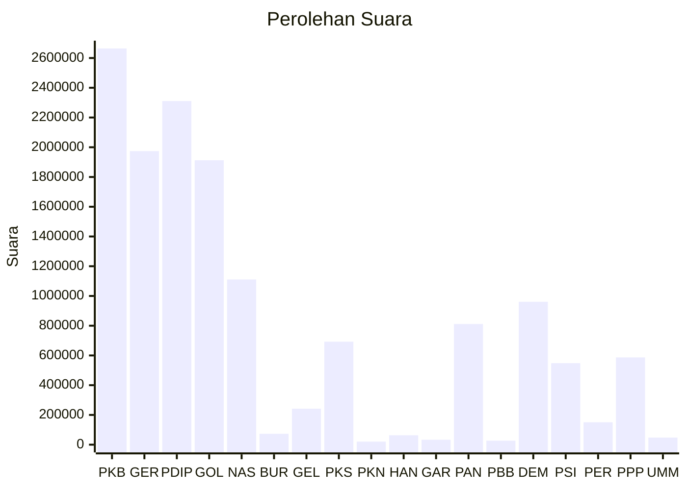

# Hasil

Wilayah **JAWA TIMUR**

## Grafik

## Tabel

| No. | Nama Partai                           | Suara     | Suara (raw) | Persentase |
|:--- |:------------------------------------- | ---------:| -----------:| ----------:|
| 1   | Partai Kebangkitan Bangsa             | 2.664.470 | 2664470     | 18,73      |
| 2   | Partai Gerakan Indonesia Raya         | 1.974.328 | 1974328     | 13,87      |
| 3   | Partai Demokrasi Indonesia Perjuangan | 2.310.738 | 2310738     | 16,24      |
| 4   | Partai Golongan Karya                 | 1.912.391 | 1912391     | 13,44      |
| 5   | Partai NasDem                         | 1.110.855 | 1110855     | 7,81       |
| 6   | Partai Buruh                          | 72.811    | 72811       | 0,51       |
| 7   | Partai Gelombang Rakyat Indonesia     | 241.780   | 241780      | 1,70       |
| 8   | Partai Keadilan Sejahtera             | 692.575   | 692575      | 4,87       |
| 9   | Partai Kebangkitan Nusantara          | 20.505    | 20505       | 0,14       |
| 10  | Partai Hati Nurani Rakyat             | 63.341    | 63341       | 0,45       |
| 11  | Partai Garda Republik Indonesia       | 32.970    | 32970       | 0,23       |
| 12  | Partai Amanat Nasional                | 811.390   | 811390      | 5,70       |
| 13  | Partai Bulan Bintang                  | 27.056    | 27056       | 0,19       |
| 14  | Partai Demokrat                       | 960.936   | 960936      | 6,75       |
| 15  | Partai Solidaritas Indonesia          | 547.955   | 547955      | 3,85       |
| 16  | PARTAI PERINDO                        | 150.624   | 150624      | 1,06       |
| 17  | Partai Persatuan Pembangunan          | 586.813   | 586813      | 4,12       |
| 24  | Partai Ummat                          | 47.881    | 47881       | 0,34       |

## Metadata

| Key             | Value   |
| --------------- | ------- |
| Tipe Pemilu     | Reguler |
| Persentase      | 74,43   |
| Status Progress | On      |

