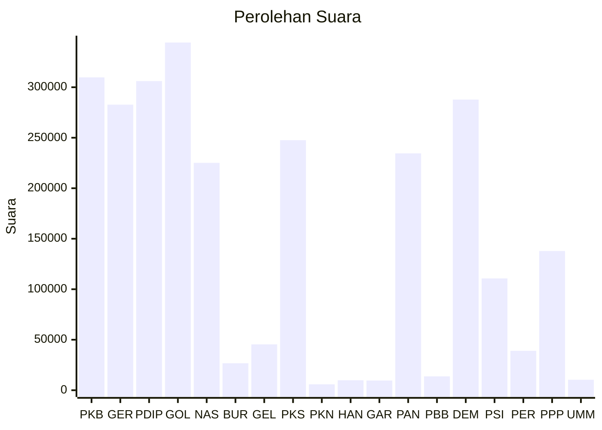

# Hasil

Wilayah **BANTEN**

## Grafik

## Tabel

| No. | Nama Partai                           | Suara   | Suara (raw) | Persentase |
|:--- |:------------------------------------- | -------:| -----------:| ----------:|
| 1   | Partai Kebangkitan Bangsa             | 309.810 | 309810      | 11,70      |
| 2   | Partai Gerakan Indonesia Raya         | 282.735 | 282735      | 10,68      |
| 3   | Partai Demokrasi Indonesia Perjuangan | 306.052 | 306052      | 11,56      |
| 4   | Partai Golongan Karya                 | 344.285 | 344285      | 13,01      |
| 5   | Partai NasDem                         | 225.126 | 225126      | 8,50       |
| 6   | Partai Buruh                          | 26.715  | 26715       | 1,01       |
| 7   | Partai Gelombang Rakyat Indonesia     | 45.409  | 45409       | 1,72       |
| 8   | Partai Keadilan Sejahtera             | 247.581 | 247581      | 9,35       |
| 9   | Partai Kebangkitan Nusantara          | 5.871   | 5871        | 0,22       |
| 10  | Partai Hati Nurani Rakyat             | 9.869   | 9869        | 0,37       |
| 11  | Partai Garda Republik Indonesia       | 9.577   | 9577        | 0,36       |
| 12  | Partai Amanat Nasional                | 234.547 | 234547      | 8,86       |
| 13  | Partai Bulan Bintang                  | 13.730  | 13730       | 0,52       |
| 14  | Partai Demokrat                       | 287.780 | 287780      | 10,87      |
| 15  | Partai Solidaritas Indonesia          | 110.682 | 110682      | 4,18       |
| 16  | PARTAI PERINDO                        | 39.007  | 39007       | 1,47       |
| 17  | Partai Persatuan Pembangunan          | 137.866 | 137866      | 5,21       |
| 24  | Partai Ummat                          | 10.371  | 10371       | 0,39       |

## Metadata

| Key             | Value   |
| --------------- | ------- |
| Tipe Pemilu     | Reguler |
| Persentase      | 67,24   |
| Status Progress | On      |

