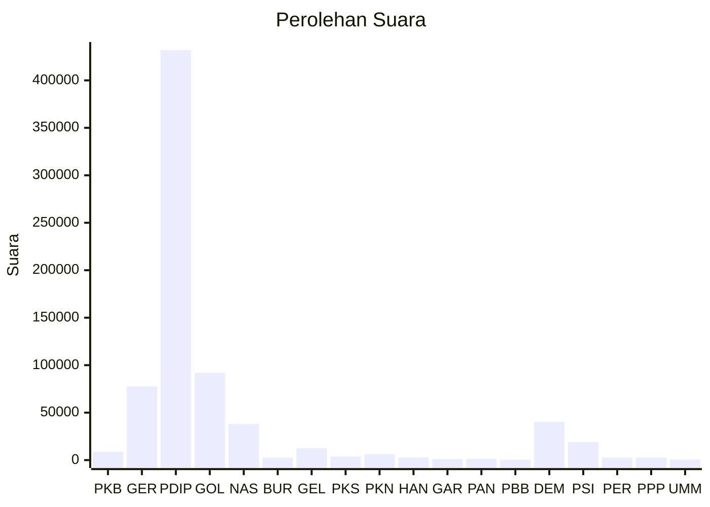

# Hasil

Wilayah **BALI**

## Grafik

## Tabel

| No. | Nama Partai                           | Suara   | Suara (raw) | Persentase |
|:--- |:------------------------------------- | -------:| -----------:| ----------:|
| 1   | Partai Kebangkitan Bangsa             | 8.756   | 8756        | 1,18       |
| 2   | Partai Gerakan Indonesia Raya         | 77.534  | 77534       | 10,42      |
| 3   | Partai Demokrasi Indonesia Perjuangan | 431.860 | 431860      | 58,04      |
| 4   | Partai Golongan Karya                 | 91.931  | 91931       | 12,35      |
| 5   | Partai NasDem                         | 38.076  | 38076       | 5,12       |
| 6   | Partai Buruh                          | 2.440   | 2440        | 0,33       |
| 7   | Partai Gelombang Rakyat Indonesia     | 12.538  | 12538       | 1,68       |
| 8   | Partai Keadilan Sejahtera             | 3.800   | 3800        | 0,51       |
| 9   | Partai Kebangkitan Nusantara          | 6.303   | 6303        | 0,85       |
| 10  | Partai Hati Nurani Rakyat             | 2.745   | 2745        | 0,37       |
| 11  | Partai Garda Republik Indonesia       | 1.186   | 1186        | 0,16       |
| 12  | Partai Amanat Nasional                | 1.325   | 1325        | 0,18       |
| 13  | Partai Bulan Bintang                  | 497     | 497         | 0,07       |
| 14  | Partai Demokrat                       | 40.310  | 40310       | 5,42       |
| 15  | Partai Solidaritas Indonesia          | 19.053  | 19053       | 2,56       |
| 16  | PARTAI PERINDO                        | 2.528   | 2528        | 0,34       |
| 17  | Partai Persatuan Pembangunan          | 2.649   | 2649        | 0,36       |
| 24  | Partai Ummat                          | 604     | 604         | 0,08       |

## Metadata

| Key             | Value   |
| --------------- | ------- |
| Tipe Pemilu     | Reguler |
| Persentase      | 42,87   |
| Status Progress | On      |

