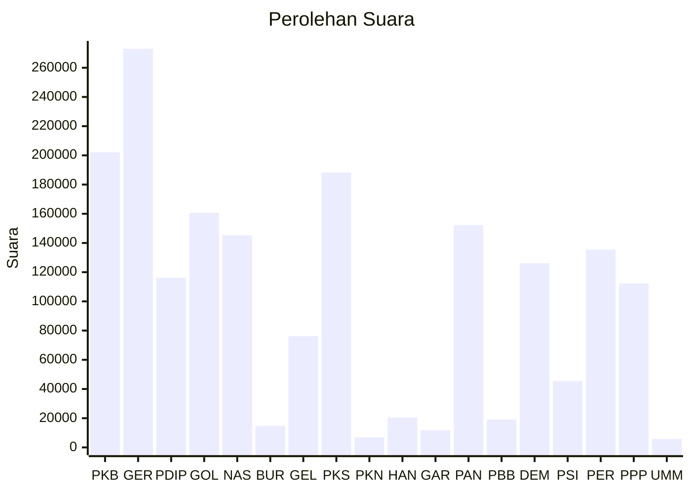

# Hasil

Wilayah **NUSA TENGGARA BARAT**

## Grafik

## Tabel

| No. | Nama Partai                           | Suara   | Suara (raw) | Persentase |
|:--- |:------------------------------------- | -------:| -----------:| ----------:|
| 1   | Partai Kebangkitan Bangsa             | 202.001 | 202001      | 11,15      |
| 2   | Partai Gerakan Indonesia Raya         | 273.031 | 273031      | 15,07      |
| 3   | Partai Demokrasi Indonesia Perjuangan | 116.178 | 116178      | 6,41       |
| 4   | Partai Golongan Karya                 | 160.649 | 160649      | 8,87       |
| 5   | Partai NasDem                         | 145.311 | 145311      | 8,02       |
| 6   | Partai Buruh                          | 14.810  | 14810       | 0,82       |
| 7   | Partai Gelombang Rakyat Indonesia     | 76.210  | 76210       | 4,21       |
| 8   | Partai Keadilan Sejahtera             | 188.292 | 188292      | 10,39      |
| 9   | Partai Kebangkitan Nusantara          | 6.968   | 6968        | 0,38       |
| 10  | Partai Hati Nurani Rakyat             | 20.398  | 20398       | 1,13       |
| 11  | Partai Garda Republik Indonesia       | 11.799  | 11799       | 0,65       |
| 12  | Partai Amanat Nasional                | 152.221 | 152221      | 8,40       |
| 13  | Partai Bulan Bintang                  | 19.028  | 19028       | 1,05       |
| 14  | Partai Demokrat                       | 126.180 | 126180      | 6,96       |
| 15  | Partai Solidaritas Indonesia          | 45.480  | 45480       | 2,51       |
| 16  | PARTAI PERINDO                        | 135.432 | 135432      | 7,47       |
| 17  | Partai Persatuan Pembangunan          | 112.286 | 112286      | 6,20       |
| 24  | Partai Ummat                          | 5.815   | 5815        | 0,32       |

## Metadata

| Key             | Value   |
| --------------- | ------- |
| Tipe Pemilu     | Reguler |
| Persentase      | 77,45   |
| Status Progress | On      |

