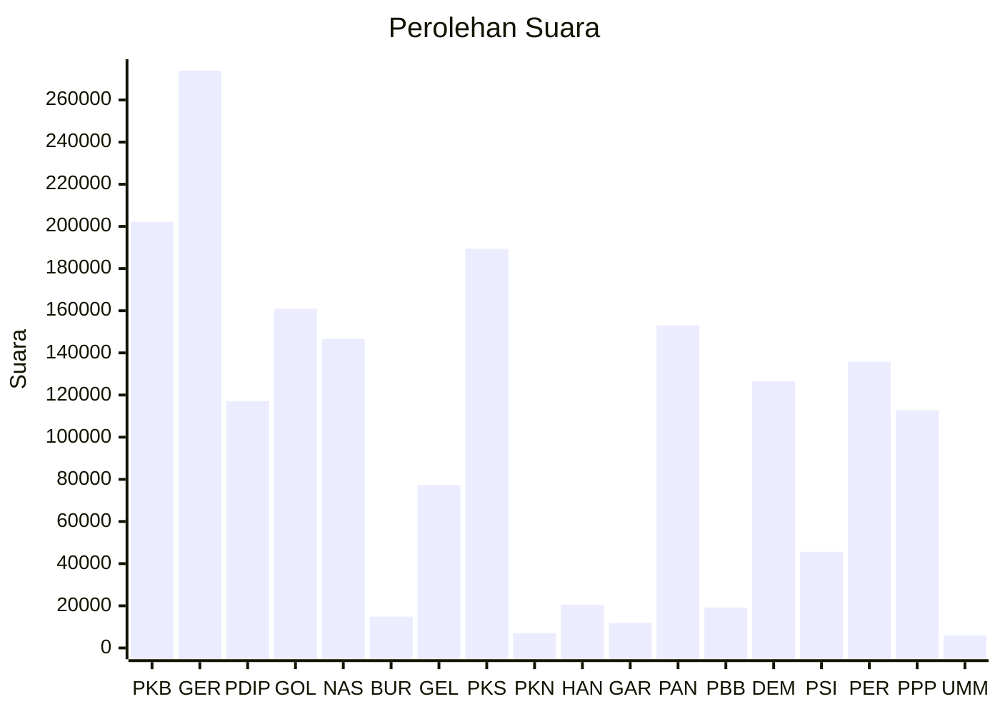

# Hasil

Wilayah **NUSA TENGGARA BARAT**

## Grafik

## Tabel

| No. | Nama Partai                           | Suara   | Suara (raw) | Persentase |
|:--- |:------------------------------------- | -------:| -----------:| ----------:|
| 1   | Partai Kebangkitan Bangsa             | 202.210 | 202210      | 11,11      |
| 2   | Partai Gerakan Indonesia Raya         | 273.931 | 273931      | 15,05      |
| 3   | Partai Demokrasi Indonesia Perjuangan | 117.129 | 117129      | 6,43       |
| 4   | Partai Golongan Karya                 | 160.975 | 160975      | 8,84       |
| 5   | Partai NasDem                         | 146.615 | 146615      | 8,05       |
| 6   | Partai Buruh                          | 14.856  | 14856       | 0,82       |
| 7   | Partai Gelombang Rakyat Indonesia     | 77.338  | 77338       | 4,25       |
| 8   | Partai Keadilan Sejahtera             | 189.384 | 189384      | 10,40      |
| 9   | Partai Kebangkitan Nusantara          | 6.981   | 6981        | 0,38       |
| 10  | Partai Hati Nurani Rakyat             | 20.489  | 20489       | 1,13       |
| 11  | Partai Garda Republik Indonesia       | 11.835  | 11835       | 0,65       |
| 12  | Partai Amanat Nasional                | 153.054 | 153054      | 8,41       |
| 13  | Partai Bulan Bintang                  | 19.160  | 19160       | 1,05       |
| 14  | Partai Demokrat                       | 126.526 | 126526      | 6,95       |
| 15  | Partai Solidaritas Indonesia          | 45.633  | 45633       | 2,51       |
| 16  | PARTAI PERINDO                        | 135.787 | 135787      | 7,46       |
| 17  | Partai Persatuan Pembangunan          | 112.799 | 112799      | 6,20       |
| 24  | Partai Ummat                          | 5.846   | 5846        | 0,32       |

## Metadata

| Key             | Value   |
| --------------- | ------- |
| Tipe Pemilu     | Reguler |
| Persentase      | 79,15   |
| Status Progress | On      |

