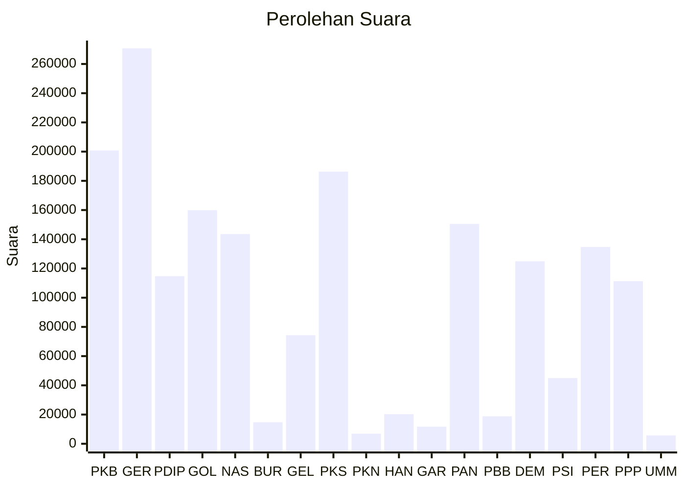

# Hasil

Wilayah **NUSA TENGGARA BARAT**

## Grafik

## Tabel

| No. | Nama Partai                           | Suara   | Suara (raw) | Persentase |
|:--- |:------------------------------------- | -------:| -----------:| ----------:|
| 1   | Partai Kebangkitan Bangsa             | 200.805 | 200805      | 11,19      |
| 2   | Partai Gerakan Indonesia Raya         | 270.705 | 270705      | 15,08      |
| 3   | Partai Demokrasi Indonesia Perjuangan | 114.757 | 114757      | 6,39       |
| 4   | Partai Golongan Karya                 | 159.934 | 159934      | 8,91       |
| 5   | Partai NasDem                         | 143.592 | 143592      | 8,00       |
| 6   | Partai Buruh                          | 14.713  | 14713       | 0,82       |
| 7   | Partai Gelombang Rakyat Indonesia     | 74.326  | 74326       | 4,14       |
| 8   | Partai Keadilan Sejahtera             | 186.286 | 186286      | 10,38      |
| 9   | Partai Kebangkitan Nusantara          | 6.897   | 6897        | 0,38       |
| 10  | Partai Hati Nurani Rakyat             | 20.282  | 20282       | 1,13       |
| 11  | Partai Garda Republik Indonesia       | 11.716  | 11716       | 0,65       |
| 12  | Partai Amanat Nasional                | 150.571 | 150571      | 8,39       |
| 13  | Partai Bulan Bintang                  | 18.794  | 18794       | 1,05       |
| 14  | Partai Demokrat                       | 124.939 | 124939      | 6,96       |
| 15  | Partai Solidaritas Indonesia          | 44.986  | 44986       | 2,51       |
| 16  | PARTAI PERINDO                        | 134.710 | 134710      | 7,50       |
| 17  | Partai Persatuan Pembangunan          | 111.316 | 111316      | 6,20       |
| 24  | Partai Ummat                          | 5.715   | 5715        | 0,32       |

## Metadata

| Key             | Value   |
| --------------- | ------- |
| Tipe Pemilu     | Reguler |
| Persentase      | 76,41   |
| Status Progress | On      |

