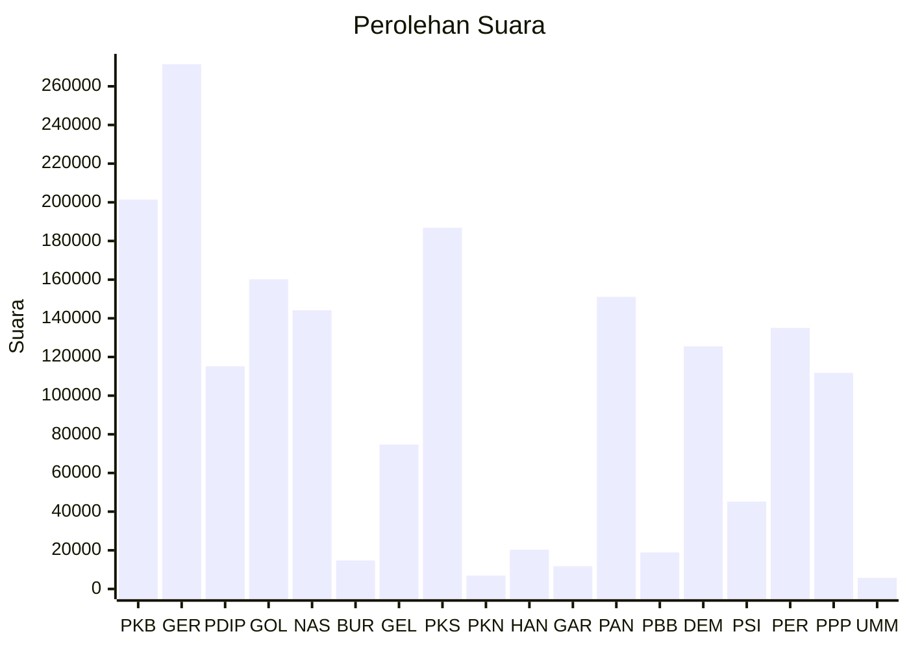

# Hasil

Wilayah **NUSA TENGGARA BARAT**

## Grafik

## Tabel

| No. | Nama Partai                           | Suara   | Suara (raw) | Persentase |
|:--- |:------------------------------------- | -------:| -----------:| ----------:|
| 1   | Partai Kebangkitan Bangsa             | 201.411 | 201411      | 11,18      |
| 2   | Partai Gerakan Indonesia Raya         | 271.457 | 271457      | 15,07      |
| 3   | Partai Demokrasi Indonesia Perjuangan | 115.161 | 115161      | 6,39       |
| 4   | Partai Golongan Karya                 | 160.177 | 160177      | 8,89       |
| 5   | Partai NasDem                         | 144.119 | 144119      | 8,00       |
| 6   | Partai Buruh                          | 14.750  | 14750       | 0,82       |
| 7   | Partai Gelombang Rakyat Indonesia     | 74.706  | 74706       | 4,15       |
| 8   | Partai Keadilan Sejahtera             | 186.791 | 186791      | 10,37      |
| 9   | Partai Kebangkitan Nusantara          | 6.935   | 6935        | 0,39       |
| 10  | Partai Hati Nurani Rakyat             | 20.323  | 20323       | 1,13       |
| 11  | Partai Garda Republik Indonesia       | 11.757  | 11757       | 0,65       |
| 12  | Partai Amanat Nasional                | 151.077 | 151077      | 8,39       |
| 13  | Partai Bulan Bintang                  | 18.894  | 18894       | 1,05       |
| 14  | Partai Demokrat                       | 125.511 | 125511      | 6,97       |
| 15  | Partai Solidaritas Indonesia          | 45.214  | 45214       | 2,51       |
| 16  | PARTAI PERINDO                        | 135.032 | 135032      | 7,50       |
| 17  | Partai Persatuan Pembangunan          | 111.803 | 111803      | 6,21       |
| 24  | Partai Ummat                          | 5.763   | 5763        | 0,32       |

## Metadata

| Key             | Value   |
| --------------- | ------- |
| Tipe Pemilu     | Reguler |
| Persentase      | 76,68   |
| Status Progress | On      |

