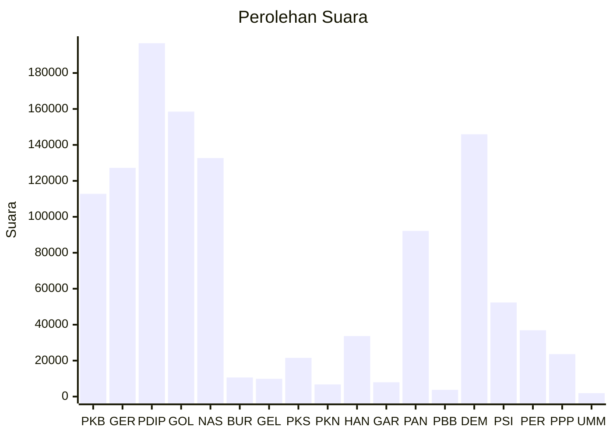

# Hasil

Wilayah **NUSA TENGGARA TIMUR**

## Grafik

## Tabel

| No. | Nama Partai                           | Suara   | Suara (raw) | Persentase |
|:--- |:------------------------------------- | -------:| -----------:| ----------:|
| 1   | Partai Kebangkitan Bangsa             | 112.774 | 112774      | 9,60       |
| 2   | Partai Gerakan Indonesia Raya         | 127.257 | 127257      | 10,83      |
| 3   | Partai Demokrasi Indonesia Perjuangan | 196.575 | 196575      | 16,73      |
| 4   | Partai Golongan Karya                 | 158.516 | 158516      | 13,49      |
| 5   | Partai NasDem                         | 132.667 | 132667      | 11,29      |
| 6   | Partai Buruh                          | 10.632  | 10632       | 0,90       |
| 7   | Partai Gelombang Rakyat Indonesia     | 9.909   | 9909        | 0,84       |
| 8   | Partai Keadilan Sejahtera             | 21.525  | 21525       | 1,83       |
| 9   | Partai Kebangkitan Nusantara          | 6.759   | 6759        | 0,58       |
| 10  | Partai Hati Nurani Rakyat             | 33.674  | 33674       | 2,87       |
| 11  | Partai Garda Republik Indonesia       | 7.954   | 7954        | 0,68       |
| 12  | Partai Amanat Nasional                | 92.157  | 92157       | 7,84       |
| 13  | Partai Bulan Bintang                  | 3.741   | 3741        | 0,32       |
| 14  | Partai Demokrat                       | 145.911 | 145911      | 12,42      |
| 15  | Partai Solidaritas Indonesia          | 52.357  | 52357       | 4,46       |
| 16  | PARTAI PERINDO                        | 36.905  | 36905       | 3,14       |
| 17  | Partai Persatuan Pembangunan          | 23.613  | 23613       | 2,01       |
| 24  | Partai Ummat                          | 1.930   | 1930        | 0,16       |

## Metadata

| Key             | Value   |
| --------------- | ------- |
| Tipe Pemilu     | Reguler |
| Persentase      | 55,71   |
| Status Progress | On      |

