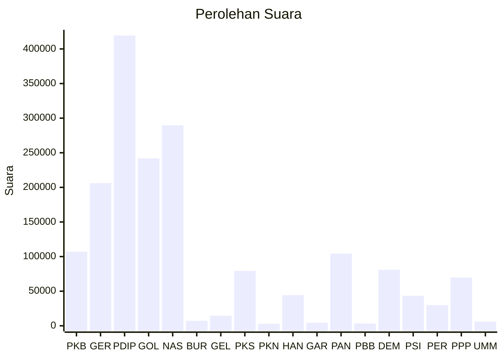

# Hasil

Wilayah **KALIMANTAN BARAT**

## Grafik

## Tabel

| No. | Nama Partai                           | Suara   | Suara (raw) | Persentase |
|:--- |:------------------------------------- | -------:| -----------:| ----------:|
| 1   | Partai Kebangkitan Bangsa             | 107.050 | 107050      | 6,10       |
| 2   | Partai Gerakan Indonesia Raya         | 206.123 | 206123      | 11,75      |
| 3   | Partai Demokrasi Indonesia Perjuangan | 419.437 | 419437      | 23,91      |
| 4   | Partai Golongan Karya                 | 241.842 | 241842      | 13,78      |
| 5   | Partai NasDem                         | 289.801 | 289801      | 16,52      |
| 6   | Partai Buruh                          | 7.152   | 7152        | 0,41       |
| 7   | Partai Gelombang Rakyat Indonesia     | 14.564  | 14564       | 0,83       |
| 8   | Partai Keadilan Sejahtera             | 79.240  | 79240       | 4,52       |
| 9   | Partai Kebangkitan Nusantara          | 2.920   | 2920        | 0,17       |
| 10  | Partai Hati Nurani Rakyat             | 44.362  | 44362       | 2,53       |
| 11  | Partai Garda Republik Indonesia       | 4.373   | 4373        | 0,25       |
| 12  | Partai Amanat Nasional                | 104.346 | 104346      | 5,95       |
| 13  | Partai Bulan Bintang                  | 3.311   | 3311        | 0,19       |
| 14  | Partai Demokrat                       | 80.952  | 80952       | 4,61       |
| 15  | Partai Solidaritas Indonesia          | 43.430  | 43430       | 2,48       |
| 16  | PARTAI PERINDO                        | 29.964  | 29964       | 1,71       |
| 17  | Partai Persatuan Pembangunan          | 69.729  | 69729       | 3,97       |
| 24  | Partai Ummat                          | 6.002   | 6002        | 0,34       |

## Metadata

| Key             | Value   |
| --------------- | ------- |
| Tipe Pemilu     | Reguler |
| Persentase      | 73,01   |
| Status Progress | On      |

