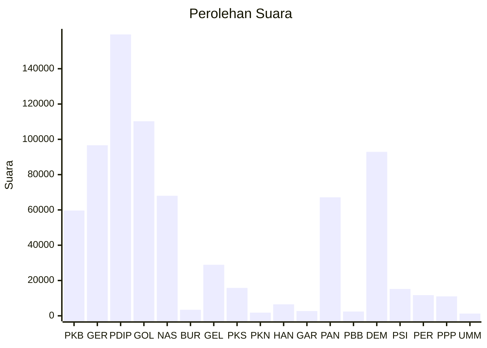

# Hasil

Wilayah **KALIMANTAN TENGAH**

## Grafik

## Tabel

| No. | Nama Partai                           | Suara   | Suara (raw) | Persentase |
|:--- |:------------------------------------- | -------:| -----------:| ----------:|
| 1   | Partai Kebangkitan Bangsa             | 59.649  | 59649       | 7,90       |
| 2   | Partai Gerakan Indonesia Raya         | 96.648  | 96648       | 12,80      |
| 3   | Partai Demokrasi Indonesia Perjuangan | 159.453 | 159453      | 21,12      |
| 4   | Partai Golongan Karya                 | 110.252 | 110252      | 14,61      |
| 5   | Partai NasDem                         | 68.027  | 68027       | 9,01       |
| 6   | Partai Buruh                          | 3.436   | 3436        | 0,46       |
| 7   | Partai Gelombang Rakyat Indonesia     | 28.920  | 28920       | 3,83       |
| 8   | Partai Keadilan Sejahtera             | 15.800  | 15800       | 2,09       |
| 9   | Partai Kebangkitan Nusantara          | 1.807   | 1807        | 0,24       |
| 10  | Partai Hati Nurani Rakyat             | 6.515   | 6515        | 0,86       |
| 11  | Partai Garda Republik Indonesia       | 2.690   | 2690        | 0,36       |
| 12  | Partai Amanat Nasional                | 67.125  | 67125       | 8,89       |
| 13  | Partai Bulan Bintang                  | 2.426   | 2426        | 0,32       |
| 14  | Partai Demokrat                       | 92.896  | 92896       | 12,31      |
| 15  | Partai Solidaritas Indonesia          | 15.203  | 15203       | 2,01       |
| 16  | PARTAI PERINDO                        | 11.726  | 11726       | 1,55       |
| 17  | Partai Persatuan Pembangunan          | 11.021  | 11021       | 1,46       |
| 24  | Partai Ummat                          | 1.250   | 1250        | 0,17       |

## Metadata

| Key             | Value   |
| --------------- | ------- |
| Tipe Pemilu     | Reguler |
| Persentase      | 67,65   |
| Status Progress | On      |

