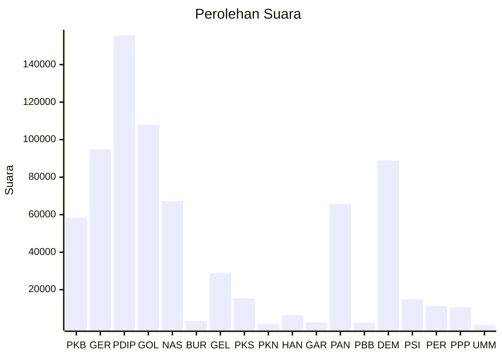

# Hasil

Wilayah **KALIMANTAN TENGAH**

## Grafik

## Tabel

| No. | Nama Partai                           | Suara   | Suara (raw) | Persentase |
|:--- |:------------------------------------- | -------:| -----------:| ----------:|
| 1   | Partai Kebangkitan Bangsa             | 58.447  | 58447       | 7,92       |
| 2   | Partai Gerakan Indonesia Raya         | 94.875  | 94875       | 12,86      |
| 3   | Partai Demokrasi Indonesia Perjuangan | 155.569 | 155569      | 21,09      |
| 4   | Partai Golongan Karya                 | 107.939 | 107939      | 14,63      |
| 5   | Partai NasDem                         | 67.248  | 67248       | 9,12       |
| 6   | Partai Buruh                          | 3.365   | 3365        | 0,46       |
| 7   | Partai Gelombang Rakyat Indonesia     | 28.871  | 28871       | 3,91       |
| 8   | Partai Keadilan Sejahtera             | 15.463  | 15463       | 2,10       |
| 9   | Partai Kebangkitan Nusantara          | 1.789   | 1789        | 0,24       |
| 10  | Partai Hati Nurani Rakyat             | 6.302   | 6302        | 0,85       |
| 11  | Partai Garda Republik Indonesia       | 2.636   | 2636        | 0,36       |
| 12  | Partai Amanat Nasional                | 65.706  | 65706       | 8,91       |
| 13  | Partai Bulan Bintang                  | 2.375   | 2375        | 0,32       |
| 14  | Partai Demokrat                       | 88.799  | 88799       | 12,04      |
| 15  | Partai Solidaritas Indonesia          | 14.917  | 14917       | 2,02       |
| 16  | PARTAI PERINDO                        | 11.414  | 11414       | 1,55       |
| 17  | Partai Persatuan Pembangunan          | 10.662  | 10662       | 1,45       |
| 24  | Partai Ummat                          | 1.235   | 1235        | 0,17       |

## Metadata

| Key             | Value   |
| --------------- | ------- |
| Tipe Pemilu     | Reguler |
| Persentase      | 64,66   |
| Status Progress | On      |

