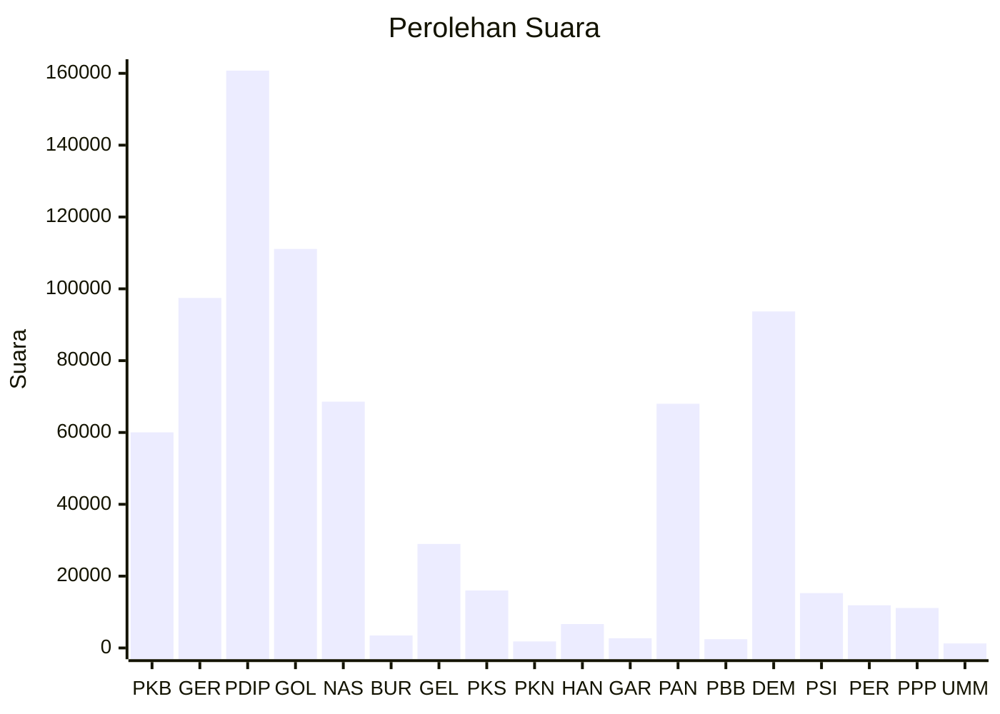

# Hasil

Wilayah **KALIMANTAN TENGAH**

## Grafik

## Tabel

| No. | Nama Partai                           | Suara   | Suara (raw) | Persentase |
|:--- |:------------------------------------- | -------:| -----------:| ----------:|
| 1   | Partai Kebangkitan Bangsa             | 60.033  | 60033       | 7,89       |
| 2   | Partai Gerakan Indonesia Raya         | 97.453  | 97453       | 12,80      |
| 3   | Partai Demokrasi Indonesia Perjuangan | 160.767 | 160767      | 21,12      |
| 4   | Partai Golongan Karya                 | 111.108 | 111108      | 14,60      |
| 5   | Partai NasDem                         | 68.584  | 68584       | 9,01       |
| 6   | Partai Buruh                          | 3.463   | 3463        | 0,45       |
| 7   | Partai Gelombang Rakyat Indonesia     | 28.958  | 28958       | 3,80       |
| 8   | Partai Keadilan Sejahtera             | 15.998  | 15998       | 2,10       |
| 9   | Partai Kebangkitan Nusantara          | 1.815   | 1815        | 0,24       |
| 10  | Partai Hati Nurani Rakyat             | 6.652   | 6652        | 0,87       |
| 11  | Partai Garda Republik Indonesia       | 2.709   | 2709        | 0,36       |
| 12  | Partai Amanat Nasional                | 67.997  | 67997       | 8,93       |
| 13  | Partai Bulan Bintang                  | 2.440   | 2440        | 0,32       |
| 14  | Partai Demokrat                       | 93.706  | 93706       | 12,31      |
| 15  | Partai Solidaritas Indonesia          | 15.281  | 15281       | 2,01       |
| 16  | PARTAI PERINDO                        | 11.887  | 11887       | 1,56       |
| 17  | Partai Persatuan Pembangunan          | 11.119  | 11119       | 1,46       |
| 24  | Partai Ummat                          | 1.258   | 1258        | 0,17       |

## Metadata

| Key             | Value   |
| --------------- | ------- |
| Tipe Pemilu     | Reguler |
| Persentase      | 68,79   |
| Status Progress | On      |

