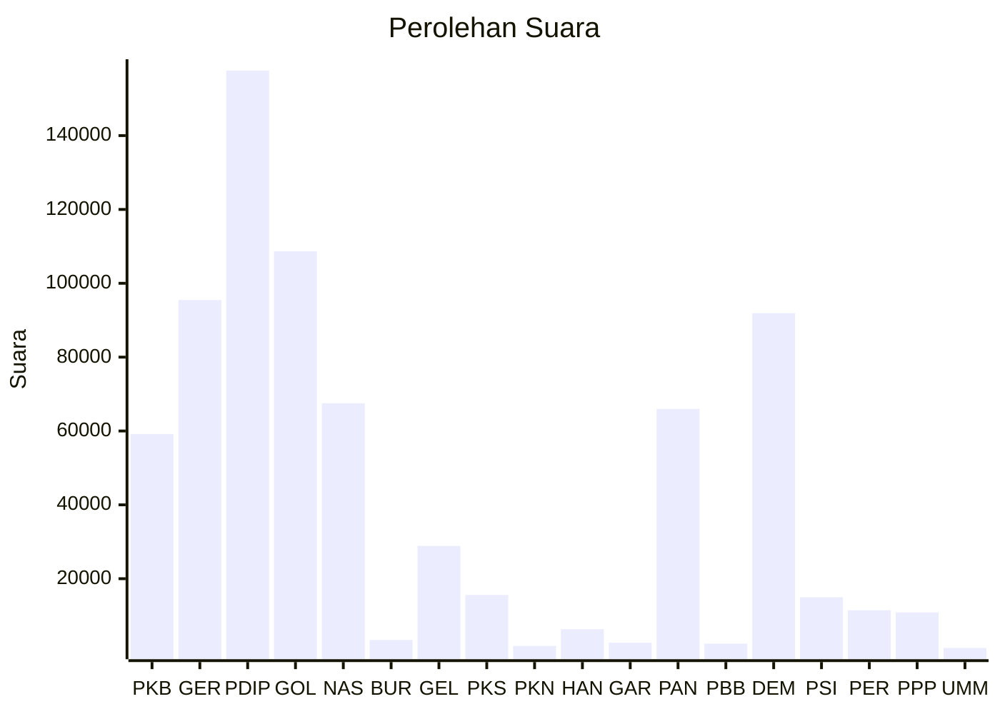

# Hasil

Wilayah **KALIMANTAN TENGAH**

## Grafik

## Tabel

| No. | Nama Partai                           | Suara   | Suara (raw) | Persentase |
|:--- |:------------------------------------- | -------:| -----------:| ----------:|
| 1   | Partai Kebangkitan Bangsa             | 59.176  | 59176       | 7,93       |
| 2   | Partai Gerakan Indonesia Raya         | 95.475  | 95475       | 12,80      |
| 3   | Partai Demokrasi Indonesia Perjuangan | 157.605 | 157605      | 21,13      |
| 4   | Partai Golongan Karya                 | 108.671 | 108671      | 14,57      |
| 5   | Partai NasDem                         | 67.518  | 67518       | 9,05       |
| 6   | Partai Buruh                          | 3.388   | 3388        | 0,45       |
| 7   | Partai Gelombang Rakyat Indonesia     | 28.880  | 28880       | 3,87       |
| 8   | Partai Keadilan Sejahtera             | 15.589  | 15589       | 2,09       |
| 9   | Partai Kebangkitan Nusantara          | 1.797   | 1797        | 0,24       |
| 10  | Partai Hati Nurani Rakyat             | 6.335   | 6335        | 0,85       |
| 11  | Partai Garda Republik Indonesia       | 2.660   | 2660        | 0,36       |
| 12  | Partai Amanat Nasional                | 65.985  | 65985       | 8,85       |
| 13  | Partai Bulan Bintang                  | 2.406   | 2406        | 0,32       |
| 14  | Partai Demokrat                       | 91.915  | 91915       | 12,32      |
| 15  | Partai Solidaritas Indonesia          | 14.984  | 14984       | 2,01       |
| 16  | PARTAI PERINDO                        | 11.464  | 11464       | 1,54       |
| 17  | Partai Persatuan Pembangunan          | 10.879  | 10879       | 1,46       |
| 24  | Partai Ummat                          | 1.242   | 1242        | 0,17       |

## Metadata

| Key             | Value   |
| --------------- | ------- |
| Tipe Pemilu     | Reguler |
| Persentase      | 65,40   |
| Status Progress | On      |

