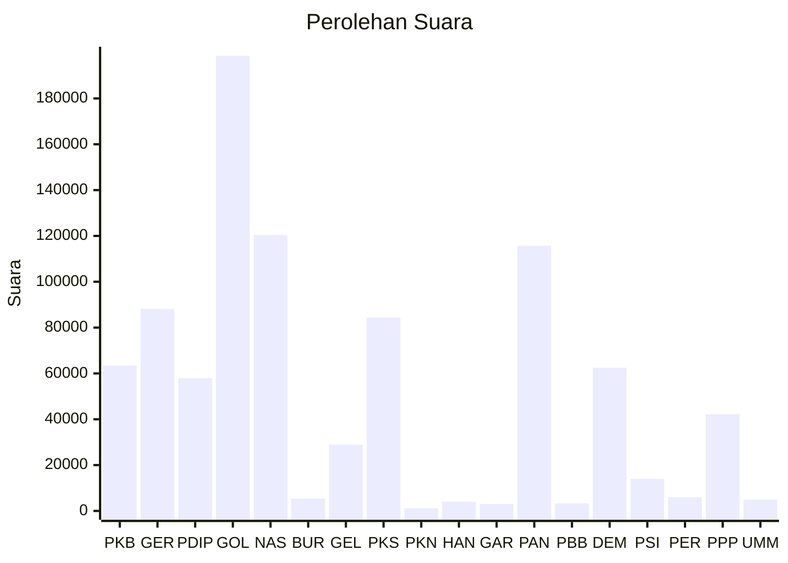

# Hasil

Wilayah **KALIMANTAN SELATAN**

## Grafik

## Tabel

| No. | Nama Partai                           | Suara   | Suara (raw) | Persentase |
|:--- |:------------------------------------- | -------:| -----------:| ----------:|
| 1   | Partai Kebangkitan Bangsa             | 63.382  | 63382       | 7,01       |
| 2   | Partai Gerakan Indonesia Raya         | 88.135  | 88135       | 9,75       |
| 3   | Partai Demokrasi Indonesia Perjuangan | 57.975  | 57975       | 6,41       |
| 4   | Partai Golongan Karya                 | 198.663 | 198663      | 21,97      |
| 5   | Partai NasDem                         | 120.401 | 120401      | 13,32      |
| 6   | Partai Buruh                          | 5.373   | 5373        | 0,59       |
| 7   | Partai Gelombang Rakyat Indonesia     | 28.926  | 28926       | 3,20       |
| 8   | Partai Keadilan Sejahtera             | 84.382  | 84382       | 9,33       |
| 9   | Partai Kebangkitan Nusantara          | 1.181   | 1181        | 0,13       |
| 10  | Partai Hati Nurani Rakyat             | 4.020   | 4020        | 0,44       |
| 11  | Partai Garda Republik Indonesia       | 3.071   | 3071        | 0,34       |
| 12  | Partai Amanat Nasional                | 115.685 | 115685      | 12,79      |
| 13  | Partai Bulan Bintang                  | 3.255   | 3255        | 0,36       |
| 14  | Partai Demokrat                       | 62.495  | 62495       | 6,91       |
| 15  | Partai Solidaritas Indonesia          | 14.014  | 14014       | 1,55       |
| 16  | PARTAI PERINDO                        | 6.037   | 6037        | 0,67       |
| 17  | Partai Persatuan Pembangunan          | 42.237  | 42237       | 4,67       |
| 24  | Partai Ummat                          | 4.994   | 4994        | 0,55       |

## Metadata

| Key             | Value   |
| --------------- | ------- |
| Tipe Pemilu     | Reguler |
| Persentase      | 54,44   |
| Status Progress | On      |

