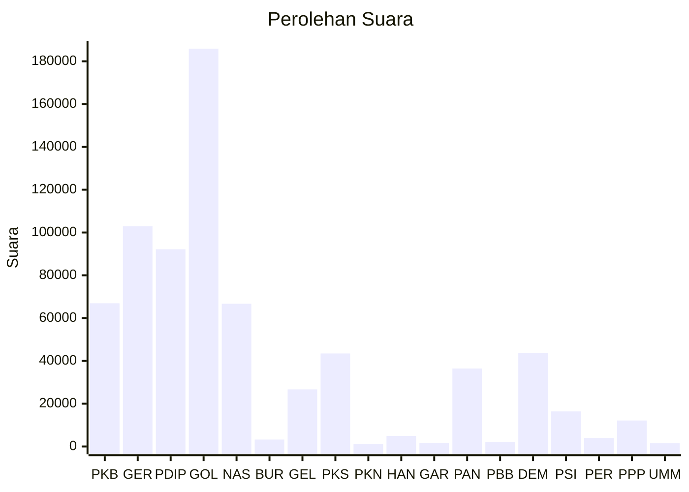

# Hasil

Wilayah **KALIMANTAN TIMUR**

## Grafik

## Tabel

| No. | Nama Partai                           | Suara   | Suara (raw) | Persentase |
|:--- |:------------------------------------- | -------:| -----------:| ----------:|
| 1   | Partai Kebangkitan Bangsa             | 66.920  | 66920       | 9,40       |
| 2   | Partai Gerakan Indonesia Raya         | 102.898 | 102898      | 14,45      |
| 3   | Partai Demokrasi Indonesia Perjuangan | 92.164  | 92164       | 12,94      |
| 4   | Partai Golongan Karya                 | 185.919 | 185919      | 26,11      |
| 5   | Partai NasDem                         | 66.705  | 66705       | 9,37       |
| 6   | Partai Buruh                          | 3.235   | 3235        | 0,45       |
| 7   | Partai Gelombang Rakyat Indonesia     | 26.687  | 26687       | 3,75       |
| 8   | Partai Keadilan Sejahtera             | 43.465  | 43465       | 6,10       |
| 9   | Partai Kebangkitan Nusantara          | 1.173   | 1173        | 0,16       |
| 10  | Partai Hati Nurani Rakyat             | 4.933   | 4933        | 0,69       |
| 11  | Partai Garda Republik Indonesia       | 1.745   | 1745        | 0,25       |
| 12  | Partai Amanat Nasional                | 36.427  | 36427       | 5,12       |
| 13  | Partai Bulan Bintang                  | 2.166   | 2166        | 0,30       |
| 14  | Partai Demokrat                       | 43.567  | 43567       | 6,12       |
| 15  | Partai Solidaritas Indonesia          | 16.384  | 16384       | 2,30       |
| 16  | PARTAI PERINDO                        | 3.982   | 3982        | 0,56       |
| 17  | Partai Persatuan Pembangunan          | 12.150  | 12150       | 1,71       |
| 24  | Partai Ummat                          | 1.565   | 1565        | 0,22       |

## Metadata

| Key             | Value   |
| --------------- | ------- |
| Tipe Pemilu     | Reguler |
| Persentase      | 55,69   |
| Status Progress | On      |

