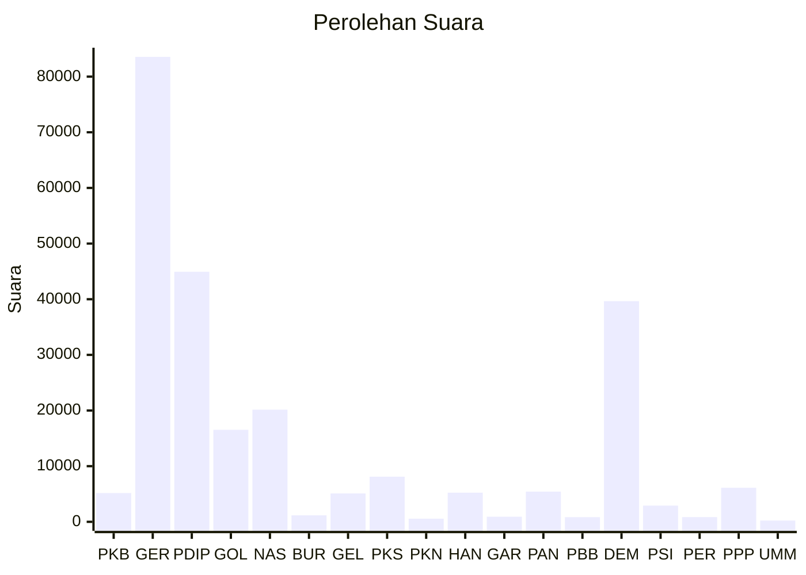

# Hasil

Wilayah **KALIMANTAN UTARA**

## Grafik

## Tabel

| No. | Nama Partai                           | Suara  | Suara (raw) | Persentase |
|:--- |:------------------------------------- | ------:| -----------:| ----------:|
| 1   | Partai Kebangkitan Bangsa             | 5.169  | 5169        | 2,09       |
| 2   | Partai Gerakan Indonesia Raya         | 83.556 | 83556       | 33,77      |
| 3   | Partai Demokrasi Indonesia Perjuangan | 44.933 | 44933       | 18,16      |
| 4   | Partai Golongan Karya                 | 16.533 | 16533       | 6,68       |
| 5   | Partai NasDem                         | 20.149 | 20149       | 8,14       |
| 6   | Partai Buruh                          | 1.165  | 1165        | 0,47       |
| 7   | Partai Gelombang Rakyat Indonesia     | 5.095  | 5095        | 2,06       |
| 8   | Partai Keadilan Sejahtera             | 8.114  | 8114        | 3,28       |
| 9   | Partai Kebangkitan Nusantara          | 563    | 563         | 0,23       |
| 10  | Partai Hati Nurani Rakyat             | 5.238  | 5238        | 2,12       |
| 11  | Partai Garda Republik Indonesia       | 924    | 924         | 0,37       |
| 12  | Partai Amanat Nasional                | 5.420  | 5420        | 2,19       |
| 13  | Partai Bulan Bintang                  | 836    | 836         | 0,34       |
| 14  | Partai Demokrat                       | 39.654 | 39654       | 16,03      |
| 15  | Partai Solidaritas Indonesia          | 2.909  | 2909        | 1,18       |
| 16  | PARTAI PERINDO                        | 844    | 844         | 0,34       |
| 17  | Partai Persatuan Pembangunan          | 6.115  | 6115        | 2,47       |
| 24  | Partai Ummat                          | 231    | 231         | 0,09       |

## Metadata

| Key             | Value   |
| --------------- | ------- |
| Tipe Pemilu     | Reguler |
| Persentase      | 72,55   |
| Status Progress | On      |

