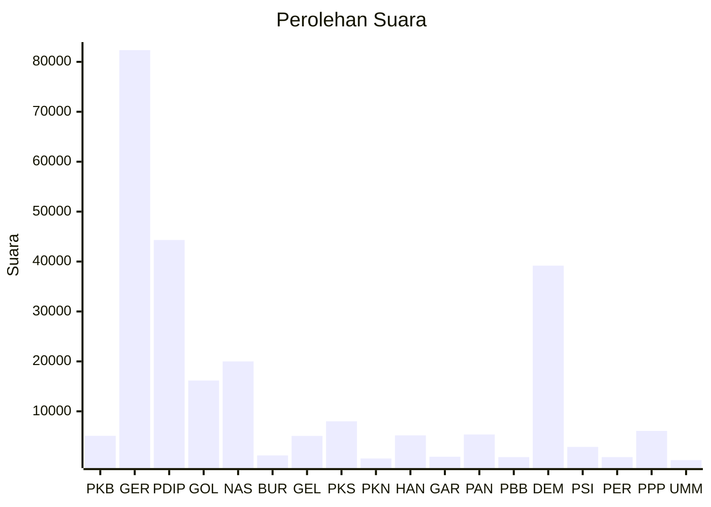

# Hasil

Wilayah **KALIMANTAN UTARA**

## Grafik

## Tabel

| No. | Nama Partai                           | Suara  | Suara (raw) | Persentase |
|:--- |:------------------------------------- | ------:| -----------:| ----------:|
| 1   | Partai Kebangkitan Bangsa             | 5.099  | 5099        | 2,09       |
| 2   | Partai Gerakan Indonesia Raya         | 82.345 | 82345       | 33,71      |
| 3   | Partai Demokrasi Indonesia Perjuangan | 44.310 | 44310       | 18,14      |
| 4   | Partai Golongan Karya                 | 16.175 | 16175       | 6,62       |
| 5   | Partai NasDem                         | 20.008 | 20008       | 8,19       |
| 6   | Partai Buruh                          | 1.165  | 1165        | 0,48       |
| 7   | Partai Gelombang Rakyat Indonesia     | 5.077  | 5077        | 2,08       |
| 8   | Partai Keadilan Sejahtera             | 8.006  | 8006        | 3,28       |
| 9   | Partai Kebangkitan Nusantara          | 559    | 559         | 0,23       |
| 10  | Partai Hati Nurani Rakyat             | 5.189  | 5189        | 2,12       |
| 11  | Partai Garda Republik Indonesia       | 911    | 911         | 0,37       |
| 12  | Partai Amanat Nasional                | 5.367  | 5367        | 2,20       |
| 13  | Partai Bulan Bintang                  | 835    | 835         | 0,34       |
| 14  | Partai Demokrat                       | 39.186 | 39186       | 16,04      |
| 15  | Partai Solidaritas Indonesia          | 2.876  | 2876        | 1,18       |
| 16  | PARTAI PERINDO                        | 836    | 836         | 0,34       |
| 17  | Partai Persatuan Pembangunan          | 6.081  | 6081        | 2,49       |
| 24  | Partai Ummat                          | 233    | 233         | 0,10       |

## Metadata

| Key             | Value   |
| --------------- | ------- |
| Tipe Pemilu     | Reguler |
| Persentase      | 69,93   |
| Status Progress | On      |

