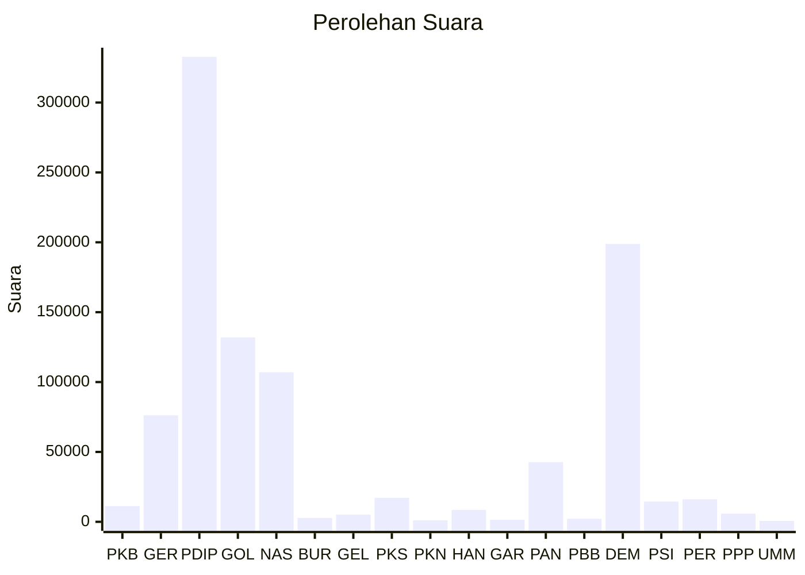

# Hasil

Wilayah **SULAWESI UTARA**

## Grafik

## Tabel

| No. | Nama Partai                           | Suara   | Suara (raw) | Persentase |
|:--- |:------------------------------------- | -------:| -----------:| ----------:|
| 1   | Partai Kebangkitan Bangsa             | 11.234  | 11234       | 1,15       |
| 2   | Partai Gerakan Indonesia Raya         | 76.244  | 76244       | 7,81       |
| 3   | Partai Demokrasi Indonesia Perjuangan | 332.697 | 332697      | 34,09      |
| 4   | Partai Golongan Karya                 | 131.911 | 131911      | 13,52      |
| 5   | Partai NasDem                         | 107.030 | 107030      | 10,97      |
| 6   | Partai Buruh                          | 2.769   | 2769        | 0,28       |
| 7   | Partai Gelombang Rakyat Indonesia     | 5.174   | 5174        | 0,53       |
| 8   | Partai Keadilan Sejahtera             | 17.144  | 17144       | 1,76       |
| 9   | Partai Kebangkitan Nusantara          | 1.102   | 1102        | 0,11       |
| 10  | Partai Hati Nurani Rakyat             | 8.543   | 8543        | 0,88       |
| 11  | Partai Garda Republik Indonesia       | 1.407   | 1407        | 0,14       |
| 12  | Partai Amanat Nasional                | 42.735  | 42735       | 4,38       |
| 13  | Partai Bulan Bintang                  | 2.181   | 2181        | 0,22       |
| 14  | Partai Demokrat                       | 198.832 | 198832      | 20,37      |
| 15  | Partai Solidaritas Indonesia          | 14.482  | 14482       | 1,48       |
| 16  | PARTAI PERINDO                        | 16.106  | 16106       | 1,65       |
| 17  | Partai Persatuan Pembangunan          | 5.821   | 5821        | 0,60       |
| 24  | Partai Ummat                          | 621     | 621         | 0,06       |

## Metadata

| Key             | Value   |
| --------------- | ------- |
| Tipe Pemilu     | Reguler |
| Persentase      | 82,33   |
| Status Progress | On      |

