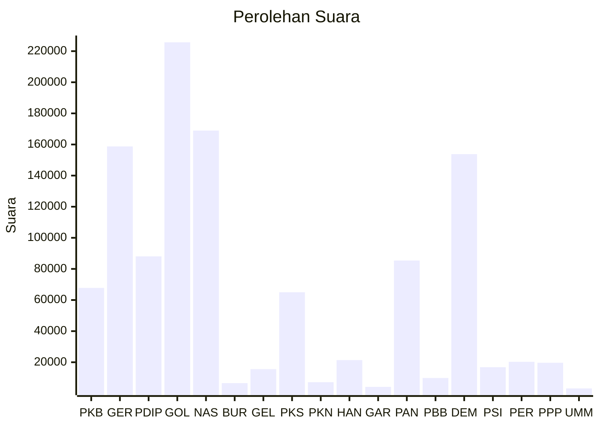

# Hasil

Wilayah **SULAWESI TENGAH**

## Grafik

## Tabel

| No. | Nama Partai                           | Suara   | Suara (raw) | Persentase |
|:--- |:------------------------------------- | -------:| -----------:| ----------:|
| 1   | Partai Kebangkitan Bangsa             | 67.814  | 67814       | 5,96       |
| 2   | Partai Gerakan Indonesia Raya         | 158.731 | 158731      | 13,95      |
| 3   | Partai Demokrasi Indonesia Perjuangan | 88.083  | 88083       | 7,74       |
| 4   | Partai Golongan Karya                 | 225.682 | 225682      | 19,83      |
| 5   | Partai NasDem                         | 168.940 | 168940      | 14,84      |
| 6   | Partai Buruh                          | 6.568   | 6568        | 0,58       |
| 7   | Partai Gelombang Rakyat Indonesia     | 15.563  | 15563       | 1,37       |
| 8   | Partai Keadilan Sejahtera             | 65.016  | 65016       | 5,71       |
| 9   | Partai Kebangkitan Nusantara          | 7.161   | 7161        | 0,63       |
| 10  | Partai Hati Nurani Rakyat             | 21.367  | 21367       | 1,88       |
| 11  | Partai Garda Republik Indonesia       | 4.170   | 4170        | 0,37       |
| 12  | Partai Amanat Nasional                | 85.384  | 85384       | 7,50       |
| 13  | Partai Bulan Bintang                  | 9.871   | 9871        | 0,87       |
| 14  | Partai Demokrat                       | 153.785 | 153785      | 13,51      |
| 15  | Partai Solidaritas Indonesia          | 16.820  | 16820       | 1,48       |
| 16  | PARTAI PERINDO                        | 20.274  | 20274       | 1,78       |
| 17  | Partai Persatuan Pembangunan          | 19.672  | 19672       | 1,73       |
| 24  | Partai Ummat                          | 3.182   | 3182        | 0,28       |

## Metadata

| Key             | Value   |
| --------------- | ------- |
| Tipe Pemilu     | Reguler |
| Persentase      | 75,11   |
| Status Progress | On      |

