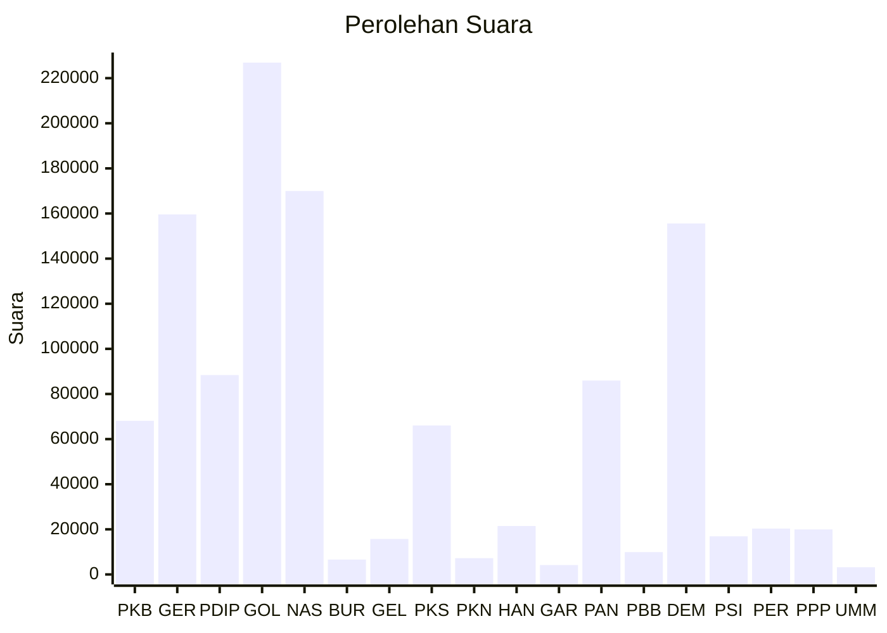

# Hasil

Wilayah **SULAWESI TENGAH**

## Grafik

## Tabel

| No. | Nama Partai                           | Suara   | Suara (raw) | Persentase |
|:--- |:------------------------------------- | -------:| -----------:| ----------:|
| 1   | Partai Kebangkitan Bangsa             | 68.111  | 68111       | 5,94       |
| 2   | Partai Gerakan Indonesia Raya         | 159.613 | 159613      | 13,93      |
| 3   | Partai Demokrasi Indonesia Perjuangan | 88.393  | 88393       | 7,71       |
| 4   | Partai Golongan Karya                 | 226.905 | 226905      | 19,80      |
| 5   | Partai NasDem                         | 169.961 | 169961      | 14,83      |
| 6   | Partai Buruh                          | 6.603   | 6603        | 0,58       |
| 7   | Partai Gelombang Rakyat Indonesia     | 15.735  | 15735       | 1,37       |
| 8   | Partai Keadilan Sejahtera             | 66.026  | 66026       | 5,76       |
| 9   | Partai Kebangkitan Nusantara          | 7.218   | 7218        | 0,63       |
| 10  | Partai Hati Nurani Rakyat             | 21.457  | 21457       | 1,87       |
| 11  | Partai Garda Republik Indonesia       | 4.187   | 4187        | 0,37       |
| 12  | Partai Amanat Nasional                | 85.951  | 85951       | 7,50       |
| 13  | Partai Bulan Bintang                  | 9.902   | 9902        | 0,86       |
| 14  | Partai Demokrat                       | 155.572 | 155572      | 13,58      |
| 15  | Partai Solidaritas Indonesia          | 16.907  | 16907       | 1,48       |
| 16  | PARTAI PERINDO                        | 20.319  | 20319       | 1,77       |
| 17  | Partai Persatuan Pembangunan          | 19.962  | 19962       | 1,74       |
| 24  | Partai Ummat                          | 3.196   | 3196        | 0,28       |

## Metadata

| Key             | Value   |
| --------------- | ------- |
| Tipe Pemilu     | Reguler |
| Persentase      | 76,65   |
| Status Progress | On      |

