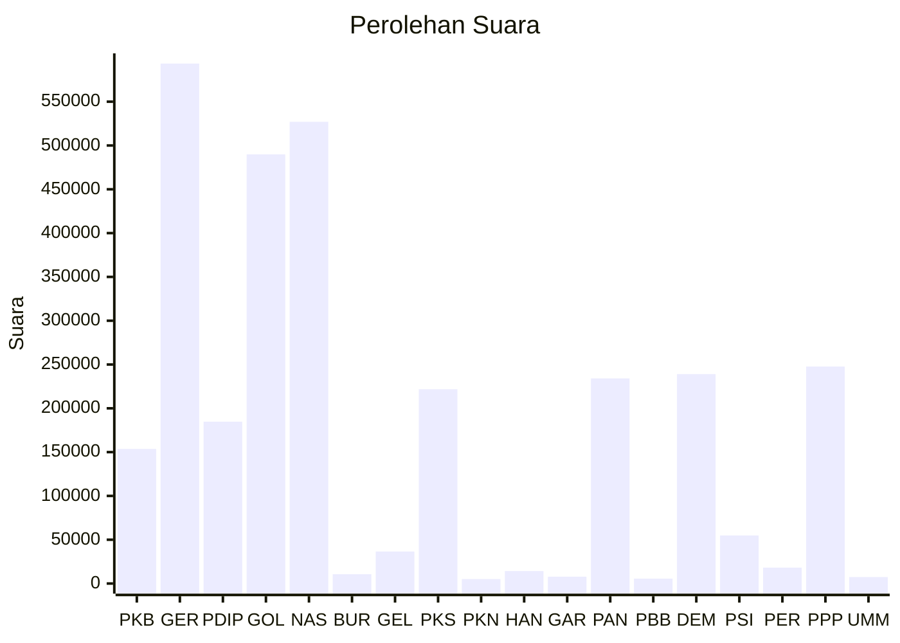

# Hasil

Wilayah **SULAWESI SELATAN**

## Grafik

## Tabel

| No. | Nama Partai                           | Suara   | Suara (raw) | Persentase |
|:--- |:------------------------------------- | -------:| -----------:| ----------:|
| 1   | Partai Kebangkitan Bangsa             | 153.594 | 153594      | 5,03       |
| 2   | Partai Gerakan Indonesia Raya         | 593.516 | 593516      | 19,45      |
| 3   | Partai Demokrasi Indonesia Perjuangan | 184.753 | 184753      | 6,05       |
| 4   | Partai Golongan Karya                 | 489.839 | 489839      | 16,05      |
| 5   | Partai NasDem                         | 527.076 | 527076      | 17,27      |
| 6   | Partai Buruh                          | 10.642  | 10642       | 0,35       |
| 7   | Partai Gelombang Rakyat Indonesia     | 36.566  | 36566       | 1,20       |
| 8   | Partai Keadilan Sejahtera             | 221.794 | 221794      | 7,27       |
| 9   | Partai Kebangkitan Nusantara          | 5.120   | 5120        | 0,17       |
| 10  | Partai Hati Nurani Rakyat             | 14.225  | 14225       | 0,47       |
| 11  | Partai Garda Republik Indonesia       | 7.794   | 7794        | 0,26       |
| 12  | Partai Amanat Nasional                | 234.138 | 234138      | 7,67       |
| 13  | Partai Bulan Bintang                  | 5.643   | 5643        | 0,18       |
| 14  | Partai Demokrat                       | 239.078 | 239078      | 7,83       |
| 15  | Partai Solidaritas Indonesia          | 54.876  | 54876       | 1,80       |
| 16  | PARTAI PERINDO                        | 18.135  | 18135       | 0,59       |
| 17  | Partai Persatuan Pembangunan          | 247.684 | 247684      | 8,12       |
| 24  | Partai Ummat                          | 7.341   | 7341        | 0,24       |

## Metadata

| Key             | Value   |
| --------------- | ------- |
| Tipe Pemilu     | Reguler |
| Persentase      | 68,02   |
| Status Progress | On      |

