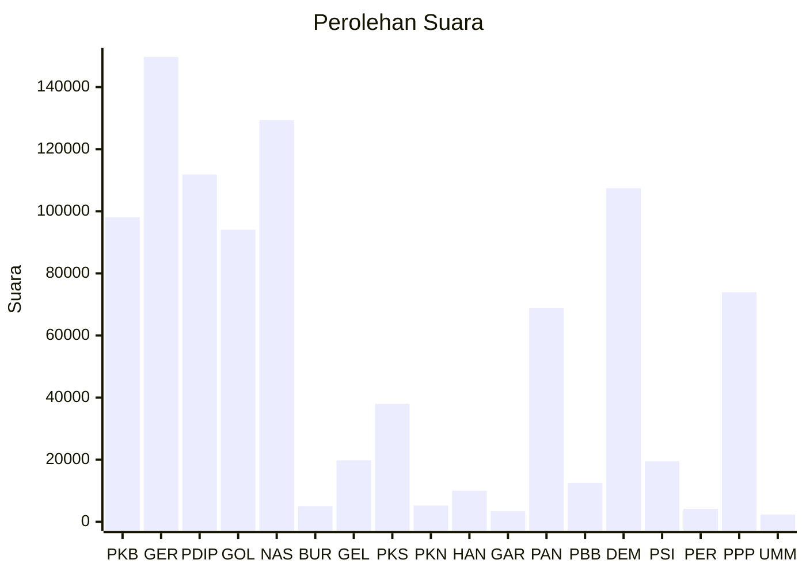

# Hasil

Wilayah **SULAWESI TENGGARA**

## Grafik

## Tabel

| No. | Nama Partai                           | Suara   | Suara (raw) | Persentase |
|:--- |:------------------------------------- | -------:| -----------:| ----------:|
| 1   | Partai Kebangkitan Bangsa             | 98.095  | 98095       | 10,29      |
| 2   | Partai Gerakan Indonesia Raya         | 149.731 | 149731      | 15,71      |
| 3   | Partai Demokrasi Indonesia Perjuangan | 111.840 | 111840      | 11,73      |
| 4   | Partai Golongan Karya                 | 94.054  | 94054       | 9,87       |
| 5   | Partai NasDem                         | 129.359 | 129359      | 13,57      |
| 6   | Partai Buruh                          | 5.026   | 5026        | 0,53       |
| 7   | Partai Gelombang Rakyat Indonesia     | 19.795  | 19795       | 2,08       |
| 8   | Partai Keadilan Sejahtera             | 37.988  | 37988       | 3,99       |
| 9   | Partai Kebangkitan Nusantara          | 5.215   | 5215        | 0,55       |
| 10  | Partai Hati Nurani Rakyat             | 10.005  | 10005       | 1,05       |
| 11  | Partai Garda Republik Indonesia       | 3.449   | 3449        | 0,36       |
| 12  | Partai Amanat Nasional                | 68.837  | 68837       | 7,22       |
| 13  | Partai Bulan Bintang                  | 12.524  | 12524       | 1,31       |
| 14  | Partai Demokrat                       | 107.413 | 107413      | 11,27      |
| 15  | Partai Solidaritas Indonesia          | 19.480  | 19480       | 2,04       |
| 16  | PARTAI PERINDO                        | 4.160   | 4160        | 0,44       |
| 17  | Partai Persatuan Pembangunan          | 73.928  | 73928       | 7,76       |
| 24  | Partai Ummat                          | 2.356   | 2356        | 0,25       |

## Metadata

| Key             | Value   |
| --------------- | ------- |
| Tipe Pemilu     | Reguler |
| Persentase      | 75,53   |
| Status Progress | On      |

