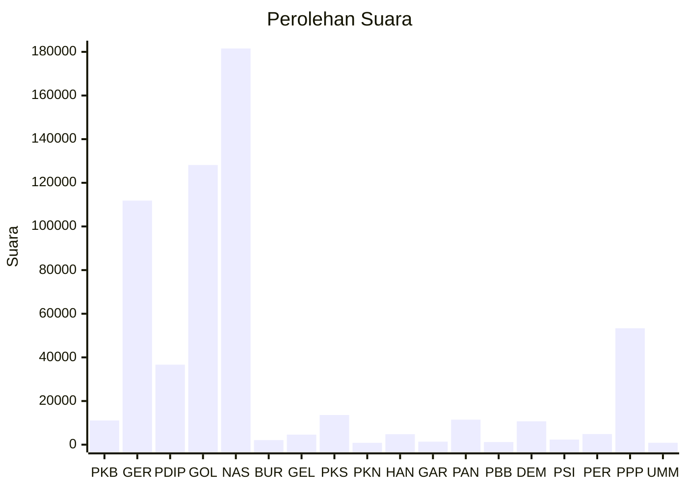

# Hasil

Wilayah **GORONTALO**

## Grafik

## Tabel

| No. | Nama Partai                           | Suara   | Suara (raw) | Persentase |
|:--- |:------------------------------------- | -------:| -----------:| ----------:|
| 1   | Partai Kebangkitan Bangsa             | 11.083  | 11083       | 1,91       |
| 2   | Partai Gerakan Indonesia Raya         | 111.852 | 111852      | 19,23      |
| 3   | Partai Demokrasi Indonesia Perjuangan | 36.661  | 36661       | 6,30       |
| 4   | Partai Golongan Karya                 | 128.177 | 128177      | 22,04      |
| 5   | Partai NasDem                         | 181.572 | 181572      | 31,22      |
| 6   | Partai Buruh                          | 2.082   | 2082        | 0,36       |
| 7   | Partai Gelombang Rakyat Indonesia     | 4.598   | 4598        | 0,79       |
| 8   | Partai Keadilan Sejahtera             | 13.606  | 13606       | 2,34       |
| 9   | Partai Kebangkitan Nusantara          | 855     | 855         | 0,15       |
| 10  | Partai Hati Nurani Rakyat             | 4.806   | 4806        | 0,83       |
| 11  | Partai Garda Republik Indonesia       | 1.370   | 1370        | 0,24       |
| 12  | Partai Amanat Nasional                | 11.469  | 11469       | 1,97       |
| 13  | Partai Bulan Bintang                  | 1.204   | 1204        | 0,21       |
| 14  | Partai Demokrat                       | 10.729  | 10729       | 1,85       |
| 15  | Partai Solidaritas Indonesia          | 2.330   | 2330        | 0,40       |
| 16  | PARTAI PERINDO                        | 4.873   | 4873        | 0,84       |
| 17  | Partai Persatuan Pembangunan          | 53.357  | 53357       | 9,18       |
| 24  | Partai Ummat                          | 882     | 882         | 0,15       |

## Metadata

| Key             | Value   |
| --------------- | ------- |
| Tipe Pemilu     | Reguler |
| Persentase      | 93,90   |
| Status Progress | On      |

