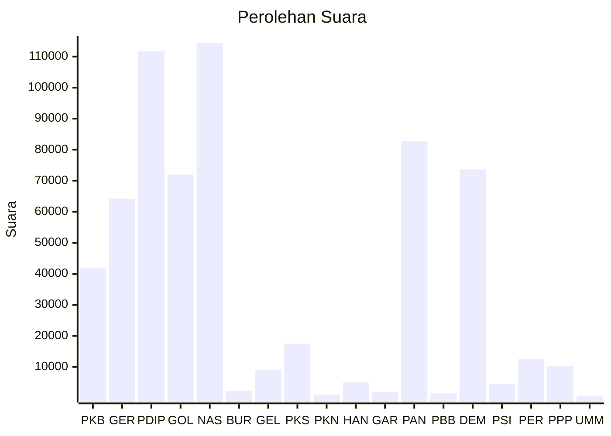

# Hasil

Wilayah **SULAWESI BARAT**

## Grafik

## Tabel

| No. | Nama Partai                           | Suara   | Suara (raw) | Persentase |
|:--- |:------------------------------------- | -------:| -----------:| ----------:|
| 1   | Partai Kebangkitan Bangsa             | 41.982  | 41982       | 6,70       |
| 2   | Partai Gerakan Indonesia Raya         | 64.208  | 64208       | 10,24      |
| 3   | Partai Demokrasi Indonesia Perjuangan | 111.689 | 111689      | 17,82      |
| 4   | Partai Golongan Karya                 | 71.936  | 71936       | 11,48      |
| 5   | Partai NasDem                         | 114.339 | 114339      | 18,24      |
| 6   | Partai Buruh                          | 2.290   | 2290        | 0,37       |
| 7   | Partai Gelombang Rakyat Indonesia     | 8.986   | 8986        | 1,43       |
| 8   | Partai Keadilan Sejahtera             | 17.485  | 17485       | 2,79       |
| 9   | Partai Kebangkitan Nusantara          | 1.124   | 1124        | 0,18       |
| 10  | Partai Hati Nurani Rakyat             | 4.983   | 4983        | 0,80       |
| 11  | Partai Garda Republik Indonesia       | 1.896   | 1896        | 0,30       |
| 12  | Partai Amanat Nasional                | 82.673  | 82673       | 13,19      |
| 13  | Partai Bulan Bintang                  | 1.472   | 1472        | 0,23       |
| 14  | Partai Demokrat                       | 73.674  | 73674       | 11,75      |
| 15  | Partai Solidaritas Indonesia          | 4.530   | 4530        | 0,72       |
| 16  | PARTAI PERINDO                        | 12.459  | 12459       | 1,99       |
| 17  | Partai Persatuan Pembangunan          | 10.327  | 10327       | 1,65       |
| 24  | Partai Ummat                          | 734     | 734         | 0,12       |

## Metadata

| Key             | Value   |
| --------------- | ------- |
| Tipe Pemilu     | Reguler |
| Persentase      | 87,82   |
| Status Progress | On      |

