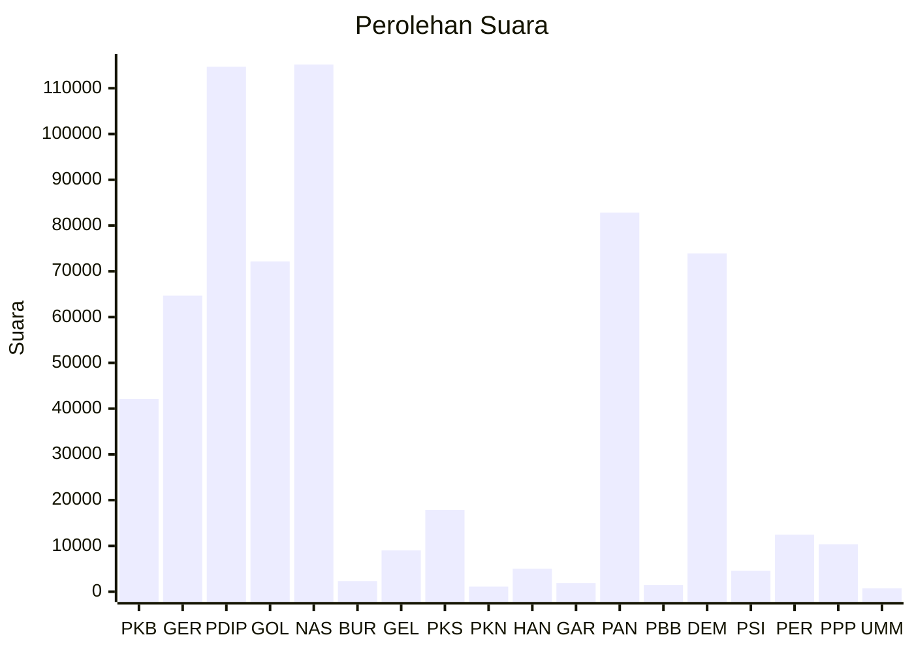

# Hasil

Wilayah **SULAWESI BARAT**

## Grafik

## Tabel

| No. | Nama Partai                           | Suara   | Suara (raw) | Persentase |
|:--- |:------------------------------------- | -------:| -----------:| ----------:|
| 1   | Partai Kebangkitan Bangsa             | 42.104  | 42104       | 6,66       |
| 2   | Partai Gerakan Indonesia Raya         | 64.676  | 64676       | 10,23      |
| 3   | Partai Demokrasi Indonesia Perjuangan | 114.695 | 114695      | 18,14      |
| 4   | Partai Golongan Karya                 | 72.151  | 72151       | 11,41      |
| 5   | Partai NasDem                         | 115.196 | 115196      | 18,21      |
| 6   | Partai Buruh                          | 2.314   | 2314        | 0,37       |
| 7   | Partai Gelombang Rakyat Indonesia     | 9.016   | 9016        | 1,43       |
| 8   | Partai Keadilan Sejahtera             | 17.876  | 17876       | 2,83       |
| 9   | Partai Kebangkitan Nusantara          | 1.127   | 1127        | 0,18       |
| 10  | Partai Hati Nurani Rakyat             | 5.012   | 5012        | 0,79       |
| 11  | Partai Garda Republik Indonesia       | 1.900   | 1900        | 0,30       |
| 12  | Partai Amanat Nasional                | 82.822  | 82822       | 13,10      |
| 13  | Partai Bulan Bintang                  | 1.475   | 1475        | 0,23       |
| 14  | Partai Demokrat                       | 73.922  | 73922       | 11,69      |
| 15  | Partai Solidaritas Indonesia          | 4.560   | 4560        | 0,72       |
| 16  | PARTAI PERINDO                        | 12.482  | 12482       | 1,97       |
| 17  | Partai Persatuan Pembangunan          | 10.370  | 10370       | 1,64       |
| 24  | Partai Ummat                          | 736     | 736         | 0,12       |

## Metadata

| Key             | Value   |
| --------------- | ------- |
| Tipe Pemilu     | Reguler |
| Persentase      | 88,43   |
| Status Progress | On      |

