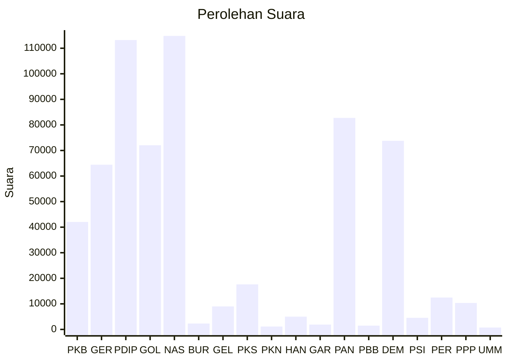

# Hasil

Wilayah **SULAWESI BARAT**

## Grafik

## Tabel

| No. | Nama Partai                           | Suara   | Suara (raw) | Persentase |
|:--- |:------------------------------------- | -------:| -----------:| ----------:|
| 1   | Partai Kebangkitan Bangsa             | 42.045  | 42045       | 6,68       |
| 2   | Partai Gerakan Indonesia Raya         | 64.451  | 64451       | 10,24      |
| 3   | Partai Demokrasi Indonesia Perjuangan | 113.200 | 113200      | 17,98      |
| 4   | Partai Golongan Karya                 | 72.042  | 72042       | 11,44      |
| 5   | Partai NasDem                         | 114.829 | 114829      | 18,24      |
| 6   | Partai Buruh                          | 2.301   | 2301        | 0,37       |
| 7   | Partai Gelombang Rakyat Indonesia     | 8.999   | 8999        | 1,43       |
| 8   | Partai Keadilan Sejahtera             | 17.634  | 17634       | 2,80       |
| 9   | Partai Kebangkitan Nusantara          | 1.126   | 1126        | 0,18       |
| 10  | Partai Hati Nurani Rakyat             | 5.000   | 5000        | 0,79       |
| 11  | Partai Garda Republik Indonesia       | 1.899   | 1899        | 0,30       |
| 12  | Partai Amanat Nasional                | 82.759  | 82759       | 13,14      |
| 13  | Partai Bulan Bintang                  | 1.472   | 1472        | 0,23       |
| 14  | Partai Demokrat                       | 73.783  | 73783       | 11,72      |
| 15  | Partai Solidaritas Indonesia          | 4.540   | 4540        | 0,72       |
| 16  | PARTAI PERINDO                        | 12.469  | 12469       | 1,98       |
| 17  | Partai Persatuan Pembangunan          | 10.348  | 10348       | 1,64       |
| 24  | Partai Ummat                          | 736     | 736         | 0,12       |

## Metadata

| Key             | Value   |
| --------------- | ------- |
| Tipe Pemilu     | Reguler |
| Persentase      | 88,10   |
| Status Progress | On      |

