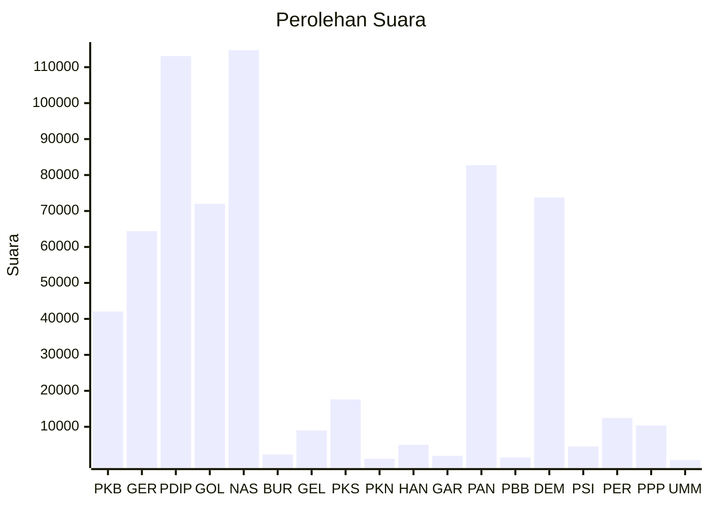

# Hasil

Wilayah **SULAWESI BARAT**

## Grafik

## Tabel

| No. | Nama Partai                           | Suara   | Suara (raw) | Persentase |
|:--- |:------------------------------------- | -------:| -----------:| ----------:|
| 1   | Partai Kebangkitan Bangsa             | 42.035  | 42035       | 6,68       |
| 2   | Partai Gerakan Indonesia Raya         | 64.405  | 64405       | 10,23      |
| 3   | Partai Demokrasi Indonesia Perjuangan | 113.087 | 113087      | 17,97      |
| 4   | Partai Golongan Karya                 | 72.024  | 72024       | 11,45      |
| 5   | Partai NasDem                         | 114.735 | 114735      | 18,23      |
| 6   | Partai Buruh                          | 2.298   | 2298        | 0,37       |
| 7   | Partai Gelombang Rakyat Indonesia     | 8.996   | 8996        | 1,43       |
| 8   | Partai Keadilan Sejahtera             | 17.619  | 17619       | 2,80       |
| 9   | Partai Kebangkitan Nusantara          | 1.124   | 1124        | 0,18       |
| 10  | Partai Hati Nurani Rakyat             | 4.996   | 4996        | 0,79       |
| 11  | Partai Garda Republik Indonesia       | 1.898   | 1898        | 0,30       |
| 12  | Partai Amanat Nasional                | 82.751  | 82751       | 13,15      |
| 13  | Partai Bulan Bintang                  | 1.472   | 1472        | 0,23       |
| 14  | Partai Demokrat                       | 73.766  | 73766       | 11,72      |
| 15  | Partai Solidaritas Indonesia          | 4.538   | 4538        | 0,72       |
| 16  | PARTAI PERINDO                        | 12.468  | 12468       | 1,98       |
| 17  | Partai Persatuan Pembangunan          | 10.346  | 10346       | 1,64       |
| 24  | Partai Ummat                          | 735     | 735         | 0,12       |

## Metadata

| Key             | Value   |
| --------------- | ------- |
| Tipe Pemilu     | Reguler |
| Persentase      | 88,05   |
| Status Progress | On      |

