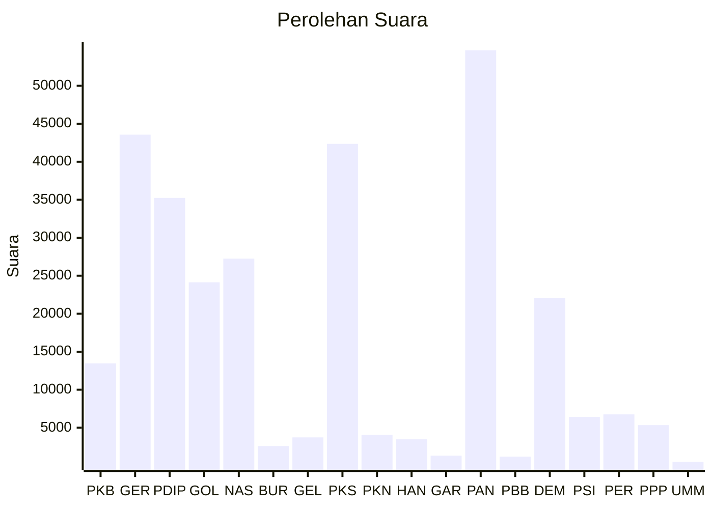

# Hasil

Wilayah **MALUKU**

## Grafik

## Tabel

| No. | Nama Partai                           | Suara  | Suara (raw) | Persentase |
|:--- |:------------------------------------- | ------:| -----------:| ----------:|
| 1   | Partai Kebangkitan Bangsa             | 13.461 | 13461       | 4,52       |
| 2   | Partai Gerakan Indonesia Raya         | 43.568 | 43568       | 14,61      |
| 3   | Partai Demokrasi Indonesia Perjuangan | 35.246 | 35246       | 11,82      |
| 4   | Partai Golongan Karya                 | 24.134 | 24134       | 8,10       |
| 5   | Partai NasDem                         | 27.260 | 27260       | 9,14       |
| 6   | Partai Buruh                          | 2.591  | 2591        | 0,87       |
| 7   | Partai Gelombang Rakyat Indonesia     | 3.726  | 3726        | 1,25       |
| 8   | Partai Keadilan Sejahtera             | 42.354 | 42354       | 14,21      |
| 9   | Partai Kebangkitan Nusantara          | 4.066  | 4066        | 1,36       |
| 10  | Partai Hati Nurani Rakyat             | 3.466  | 3466        | 1,16       |
| 11  | Partai Garda Republik Indonesia       | 1.317  | 1317        | 0,44       |
| 12  | Partai Amanat Nasional                | 54.668 | 54668       | 18,34      |
| 13  | Partai Bulan Bintang                  | 1.185  | 1185        | 0,40       |
| 14  | Partai Demokrat                       | 22.060 | 22060       | 7,40       |
| 15  | Partai Solidaritas Indonesia          | 6.430  | 6430        | 2,16       |
| 16  | PARTAI PERINDO                        | 6.751  | 6751        | 2,26       |
| 17  | Partai Persatuan Pembangunan          | 5.339  | 5339        | 1,79       |
| 24  | Partai Ummat                          | 495    | 495         | 0,17       |

## Metadata

| Key             | Value   |
| --------------- | ------- |
| Tipe Pemilu     | Reguler |
| Persentase      | 45,62   |
| Status Progress | On      |

