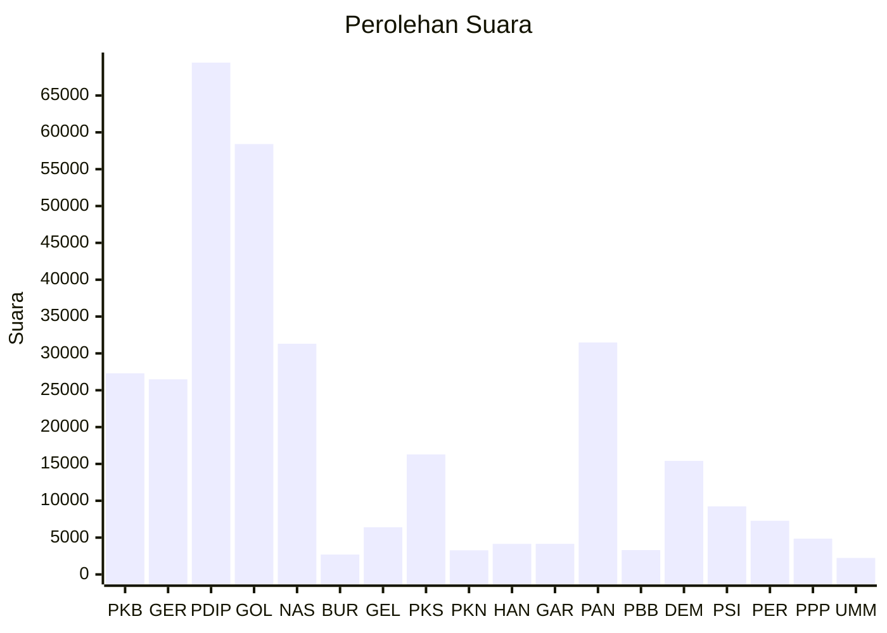

# Hasil

Wilayah **MALUKU UTARA**

## Grafik

## Tabel

| No. | Nama Partai                           | Suara  | Suara (raw) | Persentase |
|:--- |:------------------------------------- | ------:| -----------:| ----------:|
| 1   | Partai Kebangkitan Bangsa             | 27.299 | 27299       | 8,43       |
| 2   | Partai Gerakan Indonesia Raya         | 26.480 | 26480       | 8,18       |
| 3   | Partai Demokrasi Indonesia Perjuangan | 69.469 | 69469       | 21,45      |
| 4   | Partai Golongan Karya                 | 58.415 | 58415       | 18,04      |
| 5   | Partai NasDem                         | 31.315 | 31315       | 9,67       |
| 6   | Partai Buruh                          | 2.706  | 2706        | 0,84       |
| 7   | Partai Gelombang Rakyat Indonesia     | 6.409  | 6409        | 1,98       |
| 8   | Partai Keadilan Sejahtera             | 16.293 | 16293       | 5,03       |
| 9   | Partai Kebangkitan Nusantara          | 3.277  | 3277        | 1,01       |
| 10  | Partai Hati Nurani Rakyat             | 4.151  | 4151        | 1,28       |
| 11  | Partai Garda Republik Indonesia       | 4.162  | 4162        | 1,29       |
| 12  | Partai Amanat Nasional                | 31.477 | 31477       | 9,72       |
| 13  | Partai Bulan Bintang                  | 3.308  | 3308        | 1,02       |
| 14  | Partai Demokrat                       | 15.419 | 15419       | 4,76       |
| 15  | Partai Solidaritas Indonesia          | 9.245  | 9245        | 2,86       |
| 16  | PARTAI PERINDO                        | 7.285  | 7285        | 2,25       |
| 17  | Partai Persatuan Pembangunan          | 4.860  | 4860        | 1,50       |
| 24  | Partai Ummat                          | 2.238  | 2238        | 0,69       |

## Metadata

| Key             | Value   |
| --------------- | ------- |
| Tipe Pemilu     | Reguler |
| Persentase      | 44,82   |
| Status Progress | On      |

