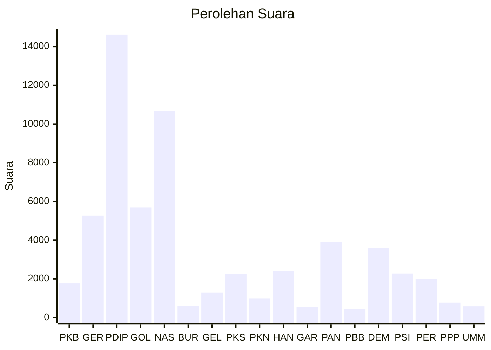

# Hasil

Wilayah **PAPUA**

## Grafik

## Tabel

| No. | Nama Partai                           | Suara  | Suara (raw) | Persentase |
|:--- |:------------------------------------- | ------:| -----------:| ----------:|
| 1   | Partai Kebangkitan Bangsa             | 1.761  | 1761        | 2,95       |
| 2   | Partai Gerakan Indonesia Raya         | 5.273  | 5273        | 8,83       |
| 3   | Partai Demokrasi Indonesia Perjuangan | 14.620 | 14620       | 24,48      |
| 4   | Partai Golongan Karya                 | 5.696  | 5696        | 9,54       |
| 5   | Partai NasDem                         | 10.684 | 10684       | 17,89      |
| 6   | Partai Buruh                          | 601    | 601         | 1,01       |
| 7   | Partai Gelombang Rakyat Indonesia     | 1.298  | 1298        | 2,17       |
| 8   | Partai Keadilan Sejahtera             | 2.243  | 2243        | 3,76       |
| 9   | Partai Kebangkitan Nusantara          | 996    | 996         | 1,67       |
| 10  | Partai Hati Nurani Rakyat             | 2.412  | 2412        | 4,04       |
| 11  | Partai Garda Republik Indonesia       | 558    | 558         | 0,93       |
| 12  | Partai Amanat Nasional                | 3.899  | 3899        | 6,53       |
| 13  | Partai Bulan Bintang                  | 448    | 448         | 0,75       |
| 14  | Partai Demokrat                       | 3.606  | 3606        | 6,04       |
| 15  | Partai Solidaritas Indonesia          | 2.274  | 2274        | 3,81       |
| 16  | PARTAI PERINDO                        | 2.000  | 2000        | 3,35       |
| 17  | Partai Persatuan Pembangunan          | 772    | 772         | 1,29       |
| 24  | Partai Ummat                          | 585    | 585         | 0,98       |

## Metadata

| Key             | Value   |
| --------------- | ------- |
| Tipe Pemilu     | Reguler |
| Persentase      | 23,09   |
| Status Progress | On      |

