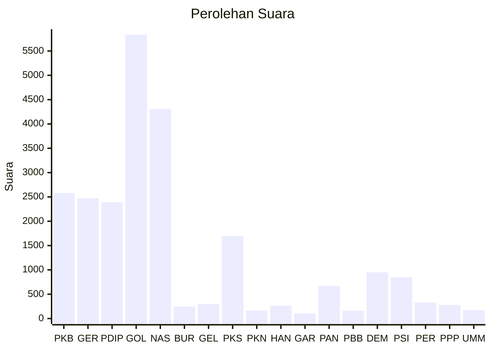

# Hasil

Wilayah **PAPUA BARAT**

## Grafik

## Tabel

| No. | Nama Partai                           | Suara | Suara (raw) | Persentase |
|:--- |:------------------------------------- | -----:| -----------:| ----------:|
| 1   | Partai Kebangkitan Bangsa             | 2.578 | 2578        | 10,85      |
| 2   | Partai Gerakan Indonesia Raya         | 2.473 | 2473        | 10,40      |
| 3   | Partai Demokrasi Indonesia Perjuangan | 2.389 | 2389        | 10,05      |
| 4   | Partai Golongan Karya                 | 5.835 | 5835        | 24,55      |
| 5   | Partai NasDem                         | 4.309 | 4309        | 18,13      |
| 6   | Partai Buruh                          | 247   | 247         | 1,04       |
| 7   | Partai Gelombang Rakyat Indonesia     | 297   | 297         | 1,25       |
| 8   | Partai Keadilan Sejahtera             | 1.698 | 1698        | 7,14       |
| 9   | Partai Kebangkitan Nusantara          | 164   | 164         | 0,69       |
| 10  | Partai Hati Nurani Rakyat             | 264   | 264         | 1,11       |
| 11  | Partai Garda Republik Indonesia       | 109   | 109         | 0,46       |
| 12  | Partai Amanat Nasional                | 670   | 670         | 2,82       |
| 13  | Partai Bulan Bintang                  | 159   | 159         | 0,67       |
| 14  | Partai Demokrat                       | 950   | 950         | 4,00       |
| 15  | Partai Solidaritas Indonesia          | 847   | 847         | 3,56       |
| 16  | PARTAI PERINDO                        | 330   | 330         | 1,39       |
| 17  | Partai Persatuan Pembangunan          | 278   | 278         | 1,17       |
| 24  | Partai Ummat                          | 173   | 173         | 0,73       |

## Metadata

| Key             | Value   |
| --------------- | ------- |
| Tipe Pemilu     | Reguler |
| Persentase      | 16,85   |
| Status Progress | On      |

