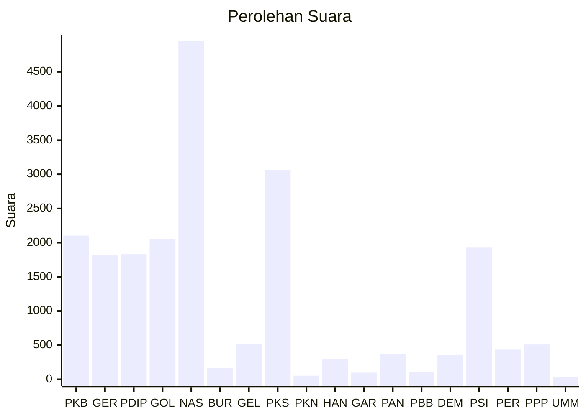

# Hasil

Wilayah **PAPUA SELATAN**

## Grafik

## Tabel

| No. | Nama Partai                           | Suara | Suara (raw) | Persentase |
|:--- |:------------------------------------- | -----:| -----------:| ----------:|
| 1   | Partai Kebangkitan Bangsa             | 2.104 | 2104        | 10,18      |
| 2   | Partai Gerakan Indonesia Raya         | 1.819 | 1819        | 8,80       |
| 3   | Partai Demokrasi Indonesia Perjuangan | 1.831 | 1831        | 8,86       |
| 4   | Partai Golongan Karya                 | 2.054 | 2054        | 9,94       |
| 5   | Partai NasDem                         | 4.947 | 4947        | 23,93      |
| 6   | Partai Buruh                          | 162   | 162         | 0,78       |
| 7   | Partai Gelombang Rakyat Indonesia     | 513   | 513         | 2,48       |
| 8   | Partai Keadilan Sejahtera             | 3.064 | 3064        | 14,82      |
| 9   | Partai Kebangkitan Nusantara          | 54    | 54          | 0,26       |
| 10  | Partai Hati Nurani Rakyat             | 292   | 292         | 1,41       |
| 11  | Partai Garda Republik Indonesia       | 98    | 98          | 0,47       |
| 12  | Partai Amanat Nasional                | 365   | 365         | 1,77       |
| 13  | Partai Bulan Bintang                  | 104   | 104         | 0,50       |
| 14  | Partai Demokrat                       | 357   | 357         | 1,73       |
| 15  | Partai Solidaritas Indonesia          | 1.928 | 1928        | 9,33       |
| 16  | PARTAI PERINDO                        | 435   | 435         | 2,10       |
| 17  | Partai Persatuan Pembangunan          | 510   | 510         | 2,47       |
| 24  | Partai Ummat                          | 35    | 35          | 0,17       |

## Metadata

| Key             | Value   |
| --------------- | ------- |
| Tipe Pemilu     | Reguler |
| Persentase      | 10,40   |
| Status Progress | On      |

