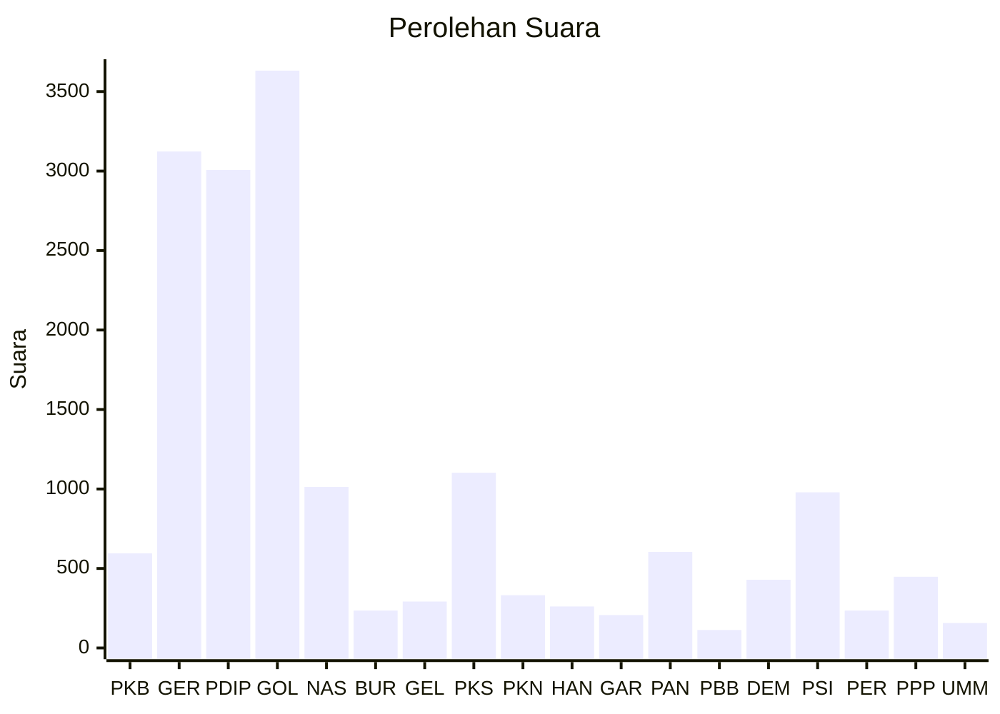

# Hasil

Wilayah **PAPUA TENGAH**

## Grafik

## Tabel

| No. | Nama Partai                           | Suara | Suara (raw) | Persentase |
|:--- |:------------------------------------- | -----:| -----------:| ----------:|
| 1   | Partai Kebangkitan Bangsa             | 595   | 595         | 3,55       |
| 2   | Partai Gerakan Indonesia Raya         | 3.123 | 3123        | 18,63      |
| 3   | Partai Demokrasi Indonesia Perjuangan | 3.007 | 3007        | 17,94      |
| 4   | Partai Golongan Karya                 | 3.632 | 3632        | 21,67      |
| 5   | Partai NasDem                         | 1.013 | 1013        | 6,04       |
| 6   | Partai Buruh                          | 235   | 235         | 1,40       |
| 7   | Partai Gelombang Rakyat Indonesia     | 292   | 292         | 1,74       |
| 8   | Partai Keadilan Sejahtera             | 1.102 | 1102        | 6,57       |
| 9   | Partai Kebangkitan Nusantara          | 332   | 332         | 1,98       |
| 10  | Partai Hati Nurani Rakyat             | 261   | 261         | 1,56       |
| 11  | Partai Garda Republik Indonesia       | 207   | 207         | 1,23       |
| 12  | Partai Amanat Nasional                | 604   | 604         | 3,60       |
| 13  | Partai Bulan Bintang                  | 113   | 113         | 0,67       |
| 14  | Partai Demokrat                       | 429   | 429         | 2,56       |
| 15  | Partai Solidaritas Indonesia          | 979   | 979         | 5,84       |
| 16  | PARTAI PERINDO                        | 235   | 235         | 1,40       |
| 17  | Partai Persatuan Pembangunan          | 448   | 448         | 2,67       |
| 24  | Partai Ummat                          | 157   | 157         | 0,94       |

## Metadata

| Key             | Value   |
| --------------- | ------- |
| Tipe Pemilu     | Reguler |
| Persentase      | 2,43    |
| Status Progress | On      |

