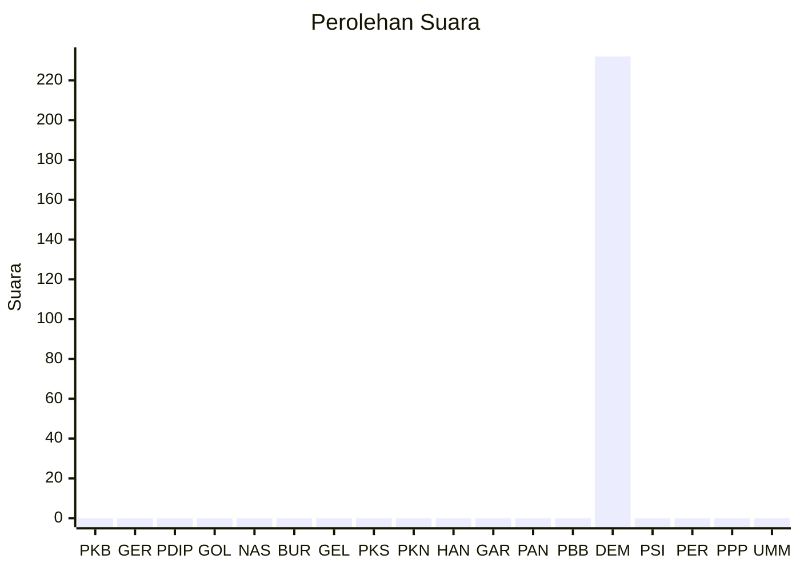

# Hasil

Wilayah **PAPUA PEGUNUNGAN**

## Grafik

## Tabel

| No. | Nama Partai                           | Suara | Suara (raw) | Persentase |
|:--- |:------------------------------------- | -----:| -----------:| ----------:|
| 1   | Partai Kebangkitan Bangsa             | 0     | 0           | 0,00       |
| 2   | Partai Gerakan Indonesia Raya         | 0     | 0           | 0,00       |
| 3   | Partai Demokrasi Indonesia Perjuangan | 0     | 0           | 0,00       |
| 4   | Partai Golongan Karya                 | 0     | 0           | 0,00       |
| 5   | Partai NasDem                         | 0     | 0           | 0,00       |
| 6   | Partai Buruh                          | 0     | 0           | 0,00       |
| 7   | Partai Gelombang Rakyat Indonesia     | 0     | 0           | 0,00       |
| 8   | Partai Keadilan Sejahtera             | 0     | 0           | 0,00       |
| 9   | Partai Kebangkitan Nusantara          | 0     | 0           | 0,00       |
| 10  | Partai Hati Nurani Rakyat             | 0     | 0           | 0,00       |
| 11  | Partai Garda Republik Indonesia       | 0     | 0           | 0,00       |
| 12  | Partai Amanat Nasional                | 0     | 0           | 0,00       |
| 13  | Partai Bulan Bintang                  | 0     | 0           | 0,00       |
| 14  | Partai Demokrat                       | 232   | 232         | 100,00     |
| 15  | Partai Solidaritas Indonesia          | 0     | 0           | 0,00       |
| 16  | PARTAI PERINDO                        | 0     | 0           | 0,00       |
| 17  | Partai Persatuan Pembangunan          | 0     | 0           | 0,00       |
| 24  | Partai Ummat                          | 0     | 0           | 0,00       |

## Metadata

| Key             | Value   |
| --------------- | ------- |
| Tipe Pemilu     | Reguler |
| Persentase      | 0,05    |
| Status Progress | On      |

