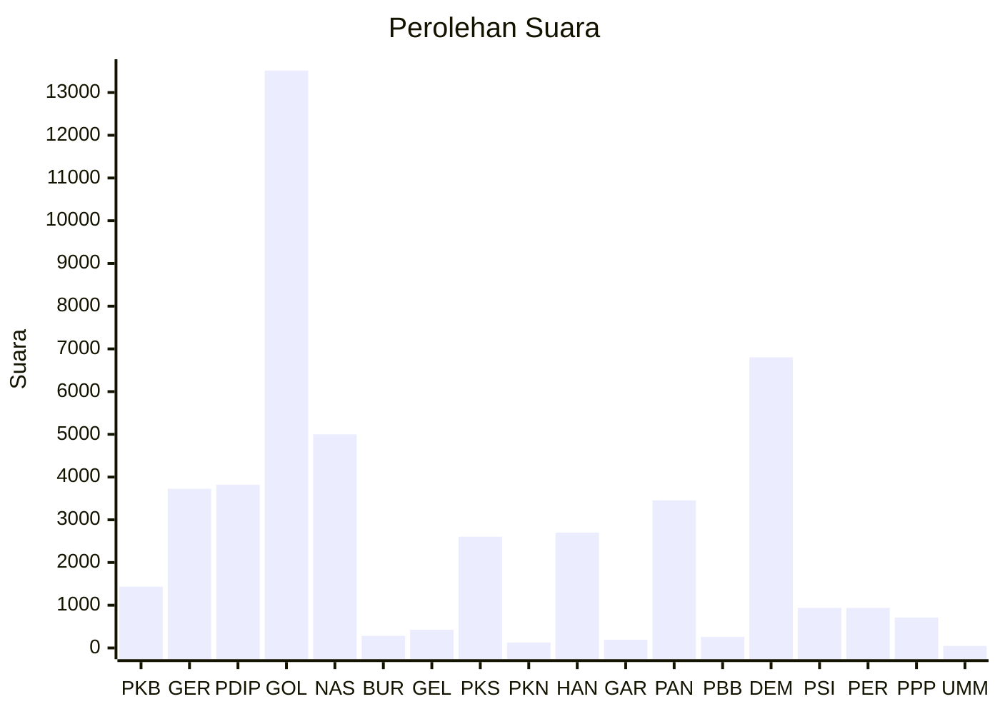

# Hasil

Wilayah **PAPUA BARAT DAYA**

## Grafik

## Tabel

| No. | Nama Partai                           | Suara  | Suara (raw) | Persentase |
|:--- |:------------------------------------- | ------:| -----------:| ----------:|
| 1   | Partai Kebangkitan Bangsa             | 1.434  | 1434        | 3,05       |
| 2   | Partai Gerakan Indonesia Raya         | 3.726  | 3726        | 7,93       |
| 3   | Partai Demokrasi Indonesia Perjuangan | 3.821  | 3821        | 8,13       |
| 4   | Partai Golongan Karya                 | 13.514 | 13514       | 28,76      |
| 5   | Partai NasDem                         | 4.999  | 4999        | 10,64      |
| 6   | Partai Buruh                          | 283    | 283         | 0,60       |
| 7   | Partai Gelombang Rakyat Indonesia     | 426    | 426         | 0,91       |
| 8   | Partai Keadilan Sejahtera             | 2.605  | 2605        | 5,54       |
| 9   | Partai Kebangkitan Nusantara          | 128    | 128         | 0,27       |
| 10  | Partai Hati Nurani Rakyat             | 2.700  | 2700        | 5,75       |
| 11  | Partai Garda Republik Indonesia       | 192    | 192         | 0,41       |
| 12  | Partai Amanat Nasional                | 3.455  | 3455        | 7,35       |
| 13  | Partai Bulan Bintang                  | 261    | 261         | 0,56       |
| 14  | Partai Demokrat                       | 6.803  | 6803        | 14,48      |
| 15  | Partai Solidaritas Indonesia          | 938    | 938         | 2,00       |
| 16  | PARTAI PERINDO                        | 938    | 938         | 2,00       |
| 17  | Partai Persatuan Pembangunan          | 715    | 715         | 1,52       |
| 24  | Partai Ummat                          | 47     | 47          | 0,10       |

## Metadata

| Key             | Value   |
| --------------- | ------- |
| Tipe Pemilu     | Reguler |
| Persentase      | 24,81   |
| Status Progress | On      |

