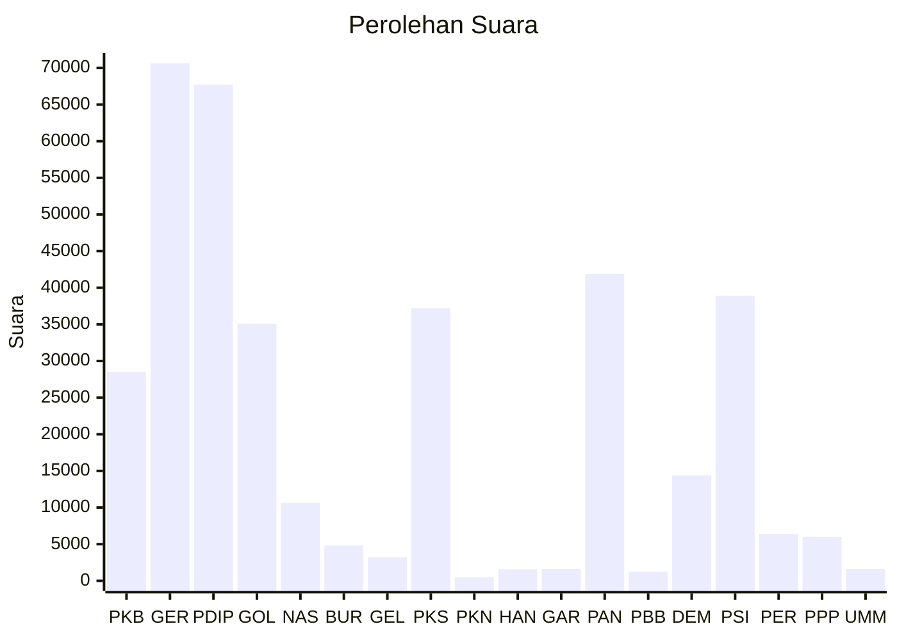

# Hasil

Wilayah **Luar Negeri**

## Grafik

## Tabel

| No. | Nama Partai                           | Suara  | Suara (raw) | Persentase |
|:--- |:------------------------------------- | ------:| -----------:| ----------:|
| 1   | Partai Kebangkitan Bangsa             | 28.499 | 28499       | 7,66       |
| 2   | Partai Gerakan Indonesia Raya         | 70.637 | 70637       | 18,99      |
| 3   | Partai Demokrasi Indonesia Perjuangan | 67.727 | 67727       | 18,21      |
| 4   | Partai Golongan Karya                 | 35.091 | 35091       | 9,43       |
| 5   | Partai NasDem                         | 10.635 | 10635       | 2,86       |
| 6   | Partai Buruh                          | 4.809  | 4809        | 1,29       |
| 7   | Partai Gelombang Rakyat Indonesia     | 3.226  | 3226        | 0,87       |
| 8   | Partai Keadilan Sejahtera             | 37.216 | 37216       | 10,01      |
| 9   | Partai Kebangkitan Nusantara          | 502    | 502         | 0,13       |
| 10  | Partai Hati Nurani Rakyat             | 1.568  | 1568        | 0,42       |
| 11  | Partai Garda Republik Indonesia       | 1.613  | 1613        | 0,43       |
| 12  | Partai Amanat Nasional                | 41.877 | 41877       | 11,26      |
| 13  | Partai Bulan Bintang                  | 1.227  | 1227        | 0,33       |
| 14  | Partai Demokrat                       | 14.393 | 14393       | 3,87       |
| 15  | Partai Solidaritas Indonesia          | 38.916 | 38916       | 10,46      |
| 16  | PARTAI PERINDO                        | 6.383  | 6383        | 1,72       |
| 17  | Partai Persatuan Pembangunan          | 6.005  | 6005        | 1,61       |
| 24  | Partai Ummat                          | 1.623  | 1623        | 0,44       |

## Metadata

| Key             | Value   |
| --------------- | ------- |
| Tipe Pemilu     | Reguler |
| Persentase      | 49,77   |
| Status Progress | On      |

