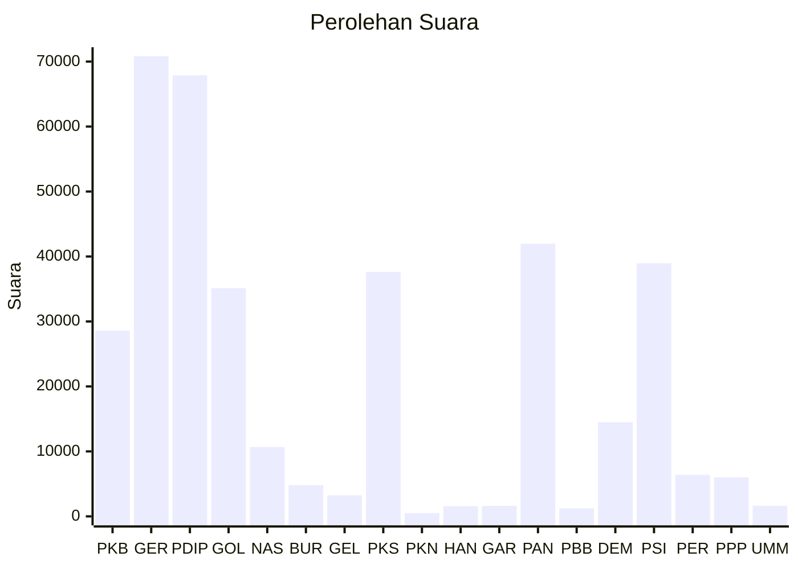

# Hasil

Wilayah **Luar Negeri**

## Grafik

## Tabel

| No. | Nama Partai                           | Suara  | Suara (raw) | Persentase |
|:--- |:------------------------------------- | ------:| -----------:| ----------:|
| 1   | Partai Kebangkitan Bangsa             | 28.580 | 28580       | 7,66       |
| 2   | Partai Gerakan Indonesia Raya         | 70.821 | 70821       | 18,98      |
| 3   | Partai Demokrasi Indonesia Perjuangan | 67.889 | 67889       | 18,20      |
| 4   | Partai Golongan Karya                 | 35.121 | 35121       | 9,41       |
| 5   | Partai NasDem                         | 10.674 | 10674       | 2,86       |
| 6   | Partai Buruh                          | 4.812  | 4812        | 1,29       |
| 7   | Partai Gelombang Rakyat Indonesia     | 3.235  | 3235        | 0,87       |
| 8   | Partai Keadilan Sejahtera             | 37.627 | 37627       | 10,08      |
| 9   | Partai Kebangkitan Nusantara          | 503    | 503         | 0,13       |
| 10  | Partai Hati Nurani Rakyat             | 1.571  | 1571        | 0,42       |
| 11  | Partai Garda Republik Indonesia       | 1.614  | 1614        | 0,43       |
| 12  | Partai Amanat Nasional                | 41.963 | 41963       | 11,25      |
| 13  | Partai Bulan Bintang                  | 1.227  | 1227        | 0,33       |
| 14  | Partai Demokrat                       | 14.484 | 14484       | 3,88       |
| 15  | Partai Solidaritas Indonesia          | 38.957 | 38957       | 10,44      |
| 16  | PARTAI PERINDO                        | 6.395  | 6395        | 1,71       |
| 17  | Partai Persatuan Pembangunan          | 6.013  | 6013        | 1,61       |
| 24  | Partai Ummat                          | 1.626  | 1626        | 0,44       |

## Metadata

| Key             | Value   |
| --------------- | ------- |
| Tipe Pemilu     | Reguler |
| Persentase      | 50,33   |
| Status Progress | On      |

