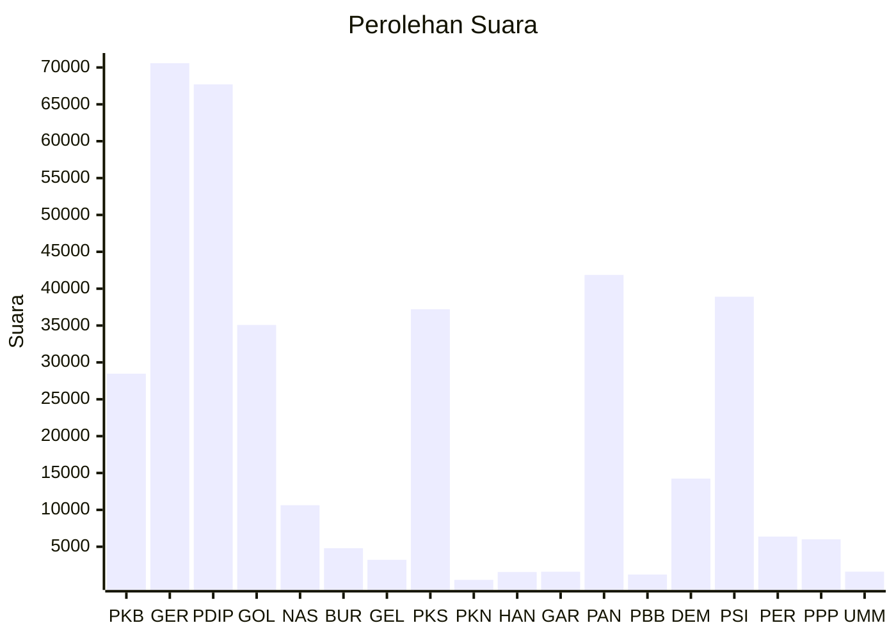

# Hasil

Wilayah **Luar Negeri**

## Grafik

## Tabel

| No. | Nama Partai                           | Suara  | Suara (raw) | Persentase |
|:--- |:------------------------------------- | ------:| -----------:| ----------:|
| 1   | Partai Kebangkitan Bangsa             | 28.473 | 28473       | 7,66       |
| 2   | Partai Gerakan Indonesia Raya         | 70.584 | 70584       | 18,99      |
| 3   | Partai Demokrasi Indonesia Perjuangan | 67.706 | 67706       | 18,22      |
| 4   | Partai Golongan Karya                 | 35.084 | 35084       | 9,44       |
| 5   | Partai NasDem                         | 10.629 | 10629       | 2,86       |
| 6   | Partai Buruh                          | 4.809  | 4809        | 1,29       |
| 7   | Partai Gelombang Rakyat Indonesia     | 3.223  | 3223        | 0,87       |
| 8   | Partai Keadilan Sejahtera             | 37.209 | 37209       | 10,01      |
| 9   | Partai Kebangkitan Nusantara          | 502    | 502         | 0,14       |
| 10  | Partai Hati Nurani Rakyat             | 1.567  | 1567        | 0,42       |
| 11  | Partai Garda Republik Indonesia       | 1.613  | 1613        | 0,43       |
| 12  | Partai Amanat Nasional                | 41.865 | 41865       | 11,26      |
| 13  | Partai Bulan Bintang                  | 1.226  | 1226        | 0,33       |
| 14  | Partai Demokrat                       | 14.246 | 14246       | 3,83       |
| 15  | Partai Solidaritas Indonesia          | 38.910 | 38910       | 10,47      |
| 16  | PARTAI PERINDO                        | 6.376  | 6376        | 1,72       |
| 17  | Partai Persatuan Pembangunan          | 6.005  | 6005        | 1,62       |
| 24  | Partai Ummat                          | 1.622  | 1622        | 0,44       |

## Metadata

| Key             | Value   |
| --------------- | ------- |
| Tipe Pemilu     | Reguler |
| Persentase      | 49,64   |
| Status Progress | On      |

