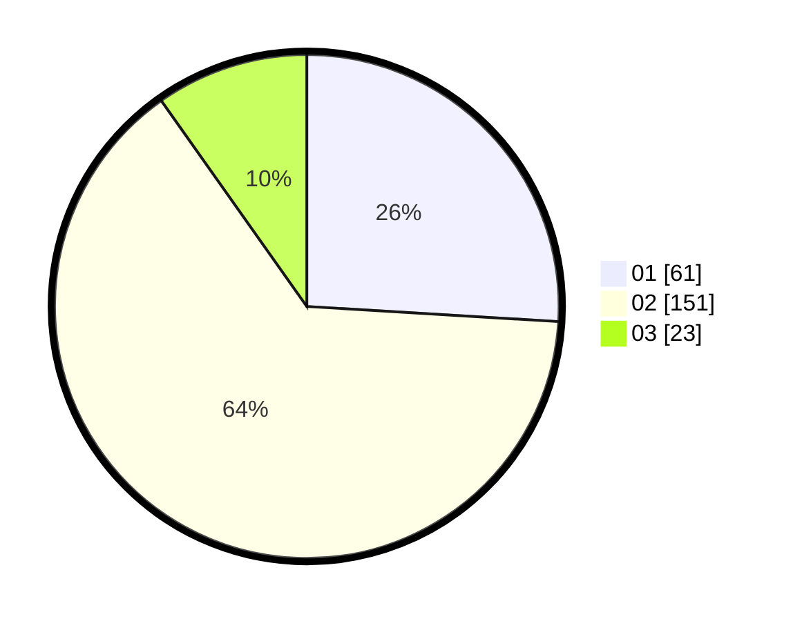

# Hasil

Hasil perolehan suara paslon dapat dilihat pada file paslon-01.txt, paslon-02.txt, dan paslon-03.txt.

Jika tidak ada, artinya data tersebut belum ada pada SIREKAP.

## Perolehan Suara

 * Paslon 01: **61**.
 * Paslon 02: **151**.
 * Paslon 03: **23**.

## Foto C Plano

https://sirekap-obj-formc.kpu.go.id/7928/pemilu/ppwp/31/01/01/10/01/3101011001004-20240217-163948--d37dd646-ecc8-4450-950a-b8d668b2defb.jpg

https://sirekap-obj-formc.kpu.go.id/7928/pemilu/ppwp/31/01/01/10/01/3101011001004-20240217-163950--c6b9786a-0c34-478d-9e31-a486010471a4.jpg

https://sirekap-obj-formc.kpu.go.id/7928/pemilu/ppwp/31/01/01/10/01/3101011001004-20240217-163949--13496c31-3a75-4bd9-bdda-f8b0448742b4.jpg

## DATA PEMILIH TETAP

Jumlah pemilih dalam DPT: **0**.
 * L: **0**.
 * P: **0**.

## DATA PENGGUNA HAK PILIH

Jumlah pengguna hak pilih dalam DPT: **0**.
 * L: **0**.
 * P: **0**.

Jumlah pengguna hak pilih dalam DPTb: **0**.
 * L: **0**.
 * P: **0**.

Jumlah pengguna hak pilih dalam DPK: **0**.
 * L: **0**.
 * P: **0**.

Jumlah pengguna hak pilih: **0**.
 * L: **0**.
 * P: **0**.

## JUMLAH SUARA SAH DAN TIDAK SAH

JUMLAH SELURUH SUARA SAH: **235**.

JUMLAH SUARA TIDAK SAH: **6**.

JUMLAH SELURUH SUARA SAH DAN SUARA TIDAK SAH: **241**.
