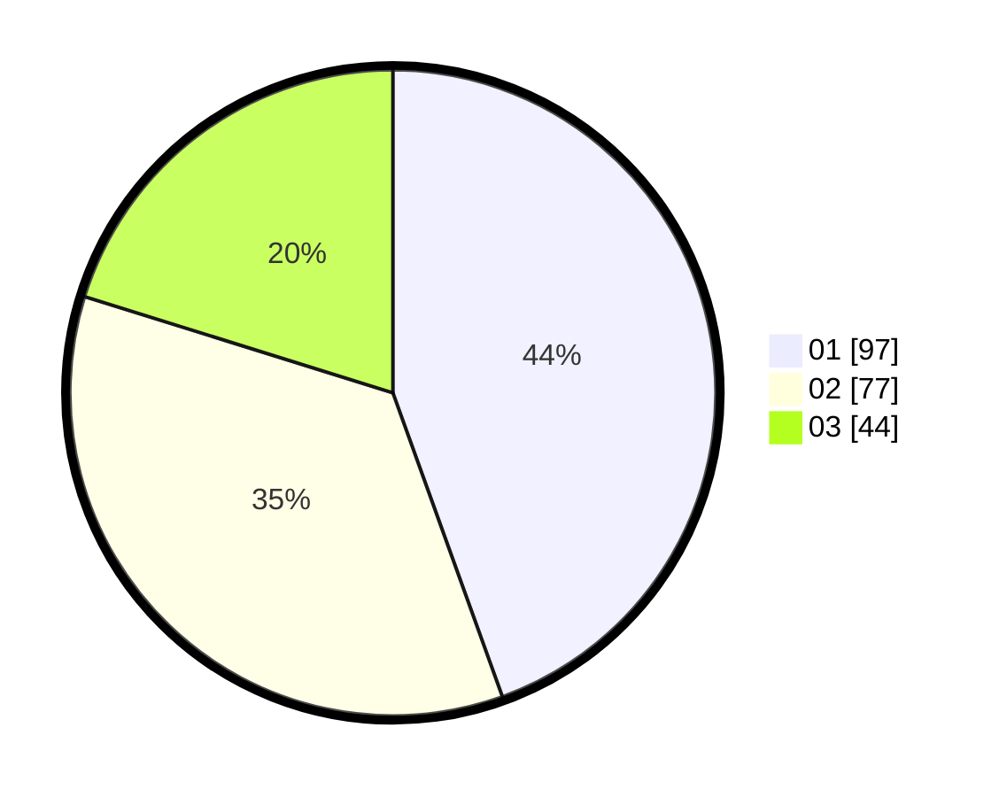

# Hasil

Hasil perolehan suara paslon dapat dilihat pada file paslon-01.txt, paslon-02.txt, dan paslon-03.txt.

Jika tidak ada, artinya data tersebut belum ada pada SIREKAP.

## Perolehan Suara

 * Paslon 01: **97**.
 * Paslon 02: **77**.
 * Paslon 03: **44**.

## Foto C Plano

https://sirekap-obj-formc.kpu.go.id/49d1/pemilu/ppwp/31/01/01/10/01/3101011001006-20240216-135711--bdd4f144-97e8-4ac1-8b26-314a6614487a.jpg

https://sirekap-obj-formc.kpu.go.id/49d1/pemilu/ppwp/31/01/01/10/01/3101011001006-20240216-135712--efe9d0e8-bdfb-4809-89e6-360fb9e06909.jpg

https://sirekap-obj-formc.kpu.go.id/49d1/pemilu/ppwp/31/01/01/10/01/3101011001006-20240216-135711--d35ede14-e3e7-40d0-86d5-7f702ab3e523.jpg

## DATA PEMILIH TETAP

Jumlah pemilih dalam DPT: **289**.
 * L: **147**.
 * P: **142**.

## DATA PENGGUNA HAK PILIH

Jumlah pengguna hak pilih dalam DPT: **213**.
 * L: **105**.
 * P: **108**.

Jumlah pengguna hak pilih dalam DPTb: **9**.
 * L: **5**.
 * P: **4**.

Jumlah pengguna hak pilih dalam DPK: **1**.
 * L: **1**.
 * P: **0**.

Jumlah pengguna hak pilih: **223**.
 * L: **111**.
 * P: **112**.

## JUMLAH SUARA SAH DAN TIDAK SAH

JUMLAH SELURUH SUARA SAH: **218**.

JUMLAH SUARA TIDAK SAH: **5**.

JUMLAH SELURUH SUARA SAH DAN SUARA TIDAK SAH: **223**.
