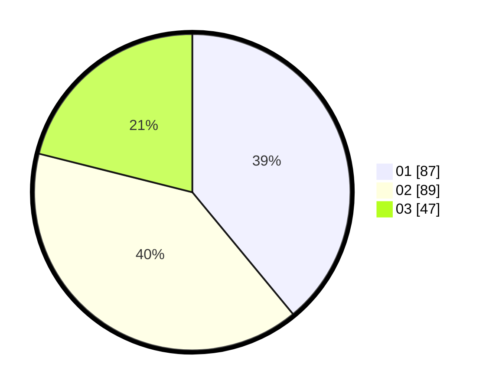

# Hasil

Hasil perolehan suara paslon dapat dilihat pada file paslon-01.txt, paslon-02.txt, dan paslon-03.txt.

Jika tidak ada, artinya data tersebut belum ada pada SIREKAP.

## Perolehan Suara

 * Paslon 01: **87**.
 * Paslon 02: **89**.
 * Paslon 03: **47**.

## Foto C Plano

https://sirekap-obj-formc.kpu.go.id/e65b/pemilu/ppwp/31/01/01/10/01/3101011001007-20240216-150608--4155b424-9031-42f8-9821-b921e2a6cee0.jpg

https://sirekap-obj-formc.kpu.go.id/e65b/pemilu/ppwp/31/01/01/10/01/3101011001007-20240216-150609--58923116-ea70-477b-b123-05da24147756.jpg

https://sirekap-obj-formc.kpu.go.id/e65b/pemilu/ppwp/31/01/01/10/01/3101011001007-20240216-150608--45ac0017-c2dc-403b-abe8-bed8fd474c23.jpg

## DATA PEMILIH TETAP

Jumlah pemilih dalam DPT: **287**.
 * L: **144**.
 * P: **143**.

## DATA PENGGUNA HAK PILIH

Jumlah pengguna hak pilih dalam DPT: **229**.
 * L: **114**.
 * P: **115**.

Jumlah pengguna hak pilih dalam DPTb: **0**.
 * L: **0**.
 * P: **0**.

Jumlah pengguna hak pilih dalam DPK: **2**.
 * L: **0**.
 * P: **2**.

Jumlah pengguna hak pilih: **231**.
 * L: **114**.
 * P: **117**.

## JUMLAH SUARA SAH DAN TIDAK SAH

JUMLAH SELURUH SUARA SAH: **223**.

JUMLAH SUARA TIDAK SAH: **8**.

JUMLAH SELURUH SUARA SAH DAN SUARA TIDAK SAH: **231**.
