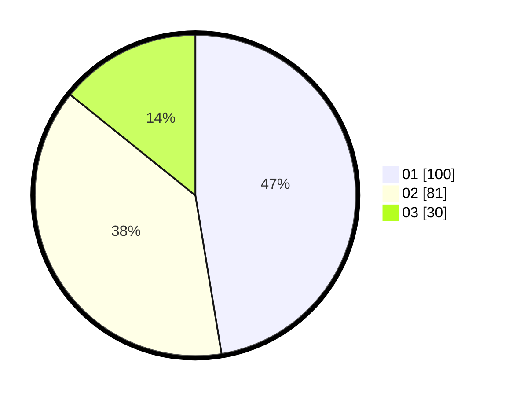

# Hasil

Hasil perolehan suara paslon dapat dilihat pada file paslon-01.txt, paslon-02.txt, dan paslon-03.txt.

Jika tidak ada, artinya data tersebut belum ada pada SIREKAP.

## Perolehan Suara

 * Paslon 01: **100**.
 * Paslon 02: **81**.
 * Paslon 03: **30**.

## Foto C Plano

https://sirekap-obj-formc.kpu.go.id/b991/pemilu/ppwp/31/01/01/10/01/3101011001008-20240215-003211--02cc39be-7bbc-466f-bd3f-0e561b42c3c5.jpg

https://sirekap-obj-formc.kpu.go.id/b991/pemilu/ppwp/31/01/01/10/01/3101011001008-20240215-085154--bde540c0-c836-4f75-8df5-173f9bdf0368.jpg

https://sirekap-obj-formc.kpu.go.id/b991/pemilu/ppwp/31/01/01/10/01/3101011001008-20240215-085347--5603b71c-df3c-4538-9908-f777c36b260e.jpg

## DATA PEMILIH TETAP

Jumlah pemilih dalam DPT: **288**.
 * L: **138**.
 * P: **150**.

## DATA PENGGUNA HAK PILIH

Jumlah pengguna hak pilih dalam DPT: **214**.
 * L: **103**.
 * P: **111**.

Jumlah pengguna hak pilih dalam DPTb: **0**.
 * L: **0**.
 * P: **0**.

Jumlah pengguna hak pilih dalam DPK: **1**.
 * L: **0**.
 * P: **1**.

Jumlah pengguna hak pilih: **215**.
 * L: **103**.
 * P: **112**.

## JUMLAH SUARA SAH DAN TIDAK SAH

JUMLAH SELURUH SUARA SAH: **211**.

JUMLAH SUARA TIDAK SAH: **4**.

JUMLAH SELURUH SUARA SAH DAN SUARA TIDAK SAH: **215**.
