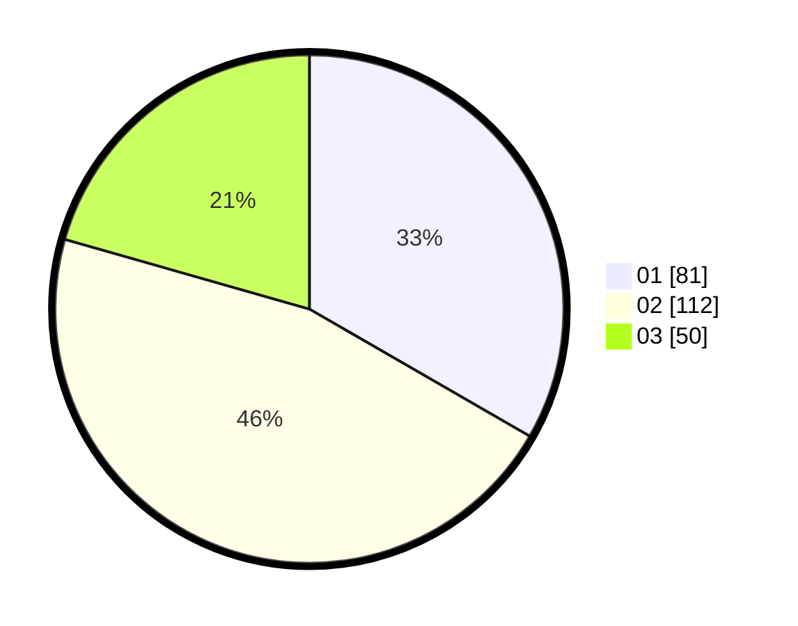

# Hasil

Hasil perolehan suara paslon dapat dilihat pada file paslon-01.txt, paslon-02.txt, dan paslon-03.txt.

Jika tidak ada, artinya data tersebut belum ada pada SIREKAP.

## Perolehan Suara

 * Paslon 01: **81**.
 * Paslon 02: **112**.
 * Paslon 03: **50**.

## Foto C Plano

https://sirekap-obj-formc.kpu.go.id/5f98/pemilu/ppwp/31/01/01/10/01/3101011001009-20240214-185113--a677fc6f-0648-4df0-b17c-7a7b599d1bda.jpg

https://sirekap-obj-formc.kpu.go.id/5f98/pemilu/ppwp/31/01/01/10/01/3101011001009-20240214-185242--35aa41ed-beb6-4f0b-9008-1e797ab47042.jpg

https://sirekap-obj-formc.kpu.go.id/5f98/pemilu/ppwp/31/01/01/10/01/3101011001009-20240214-185338--adb4bfd7-5fc9-4674-8f5d-4021cbc23078.jpg

## DATA PEMILIH TETAP

Jumlah pemilih dalam DPT: **289**.
 * L: **154**.
 * P: **135**.

## DATA PENGGUNA HAK PILIH

Jumlah pengguna hak pilih dalam DPT: **244**.
 * L: **125**.
 * P: **119**.

Jumlah pengguna hak pilih dalam DPTb: **0**.
 * L: **0**.
 * P: **0**.

Jumlah pengguna hak pilih dalam DPK: **2**.
 * L: **1**.
 * P: **1**.

Jumlah pengguna hak pilih: **246**.
 * L: **126**.
 * P: **120**.

## JUMLAH SUARA SAH DAN TIDAK SAH

JUMLAH SELURUH SUARA SAH: **243**.

JUMLAH SUARA TIDAK SAH: **3**.

JUMLAH SELURUH SUARA SAH DAN SUARA TIDAK SAH: **246**.
