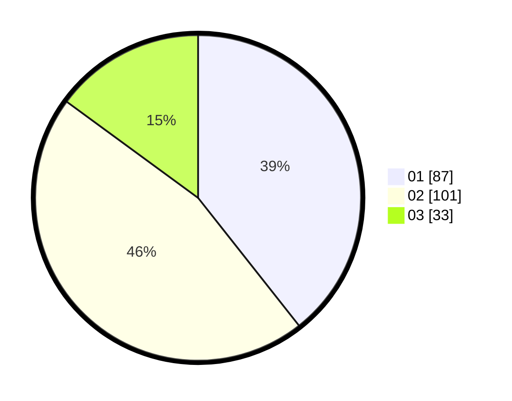

# Hasil

Hasil perolehan suara paslon dapat dilihat pada file paslon-01.txt, paslon-02.txt, dan paslon-03.txt.

Jika tidak ada, artinya data tersebut belum ada pada SIREKAP.

## Perolehan Suara

 * Paslon 01: **87**.
 * Paslon 02: **101**.
 * Paslon 03: **33**.

## Foto C Plano

https://sirekap-obj-formc.kpu.go.id/477b/pemilu/ppwp/31/01/01/10/01/3101011001010-20240215-005153--68cc1101-644d-4f5f-a2fc-92eaeeef5832.jpg

https://sirekap-obj-formc.kpu.go.id/477b/pemilu/ppwp/31/01/01/10/01/3101011001010-20240215-005600--9a6c3735-9647-4007-aaf1-c287c4c93be6.jpg

https://sirekap-obj-formc.kpu.go.id/477b/pemilu/ppwp/31/01/01/10/01/3101011001010-20240216-132554--bc57ee12-d1fc-46f5-8d02-c67a127634f1.jpg

## DATA PEMILIH TETAP

Jumlah pemilih dalam DPT: **292**.
 * L: **151**.
 * P: **141**.

## DATA PENGGUNA HAK PILIH

Jumlah pengguna hak pilih dalam DPT: **222**.
 * L: **105**.
 * P: **117**.

Jumlah pengguna hak pilih dalam DPTb: **0**.
 * L: **0**.
 * P: **0**.

Jumlah pengguna hak pilih dalam DPK: **2**.
 * L: **1**.
 * P: **1**.

Jumlah pengguna hak pilih: **224**.
 * L: **106**.
 * P: **118**.

## JUMLAH SUARA SAH DAN TIDAK SAH

JUMLAH SELURUH SUARA SAH: **221**.

JUMLAH SUARA TIDAK SAH: **3**.

JUMLAH SELURUH SUARA SAH DAN SUARA TIDAK SAH: **224**.
