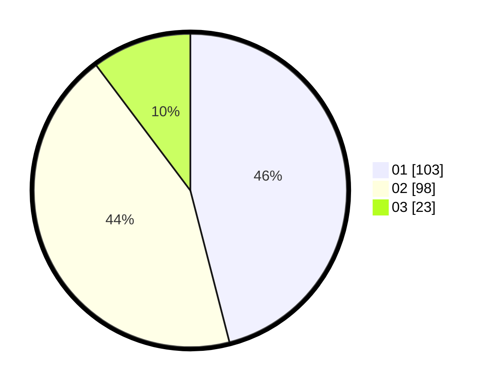

# Hasil

Hasil perolehan suara paslon dapat dilihat pada file paslon-01.txt, paslon-02.txt, dan paslon-03.txt.

Jika tidak ada, artinya data tersebut belum ada pada SIREKAP.

## Perolehan Suara

 * Paslon 01: **103**.
 * Paslon 02: **98**.
 * Paslon 03: **23**.

## Foto C Plano

https://sirekap-obj-formc.kpu.go.id/2fc1/pemilu/ppwp/31/01/01/10/01/3101011001011-20240218-142453--eb05f7d1-ed1e-43f4-a533-d7cb5fba7a9f.jpg

https://sirekap-obj-formc.kpu.go.id/2fc1/pemilu/ppwp/31/01/01/10/01/3101011001011-20240218-142454--5deb8ef2-3493-41d6-baa1-8fb84d67ee77.jpg

https://sirekap-obj-formc.kpu.go.id/2fc1/pemilu/ppwp/31/01/01/10/01/3101011001011-20240218-101847--158583d4-4284-4b36-93fd-1359d9c730ef.jpg

## DATA PEMILIH TETAP

Jumlah pemilih dalam DPT: **288**.
 * L: **149**.
 * P: **139**.

## DATA PENGGUNA HAK PILIH

Jumlah pengguna hak pilih dalam DPT: **227**.
 * L: **117**.
 * P: **110**.

Jumlah pengguna hak pilih dalam DPTb: **0**.
 * L: **0**.
 * P: **1**.

Jumlah pengguna hak pilih dalam DPK: **0**.
 * L: **1**.
 * P: **0**.

Jumlah pengguna hak pilih: **229**.
 * L: **118**.
 * P: **111**.

## JUMLAH SUARA SAH DAN TIDAK SAH

JUMLAH SELURUH SUARA SAH: **224**.

JUMLAH SUARA TIDAK SAH: **5**.

JUMLAH SELURUH SUARA SAH DAN SUARA TIDAK SAH: **229**.
