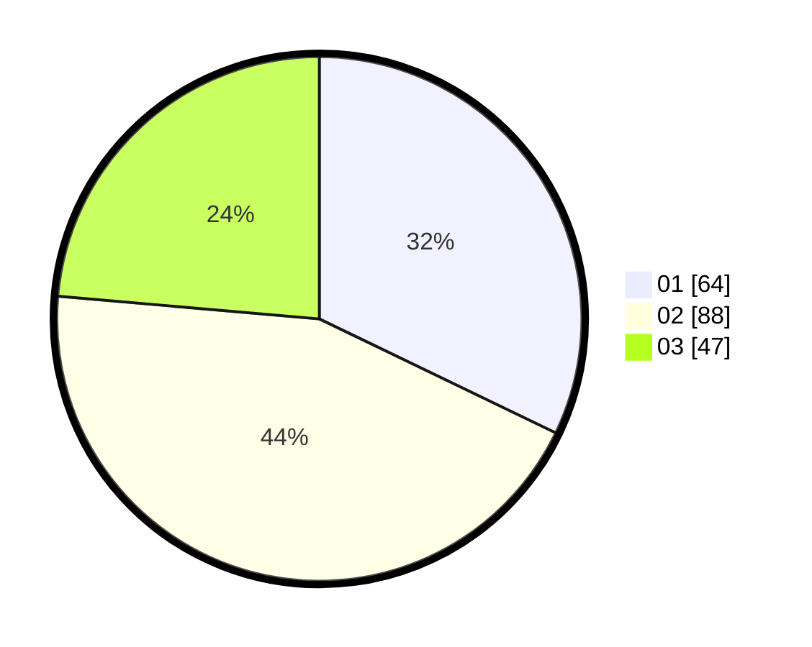

# Hasil

Hasil perolehan suara paslon dapat dilihat pada file paslon-01.txt, paslon-02.txt, dan paslon-03.txt.

Jika tidak ada, artinya data tersebut belum ada pada SIREKAP.

## Perolehan Suara

 * Paslon 01: **64**.
 * Paslon 02: **88**.
 * Paslon 03: **47**.

## Foto C Plano

https://sirekap-obj-formc.kpu.go.id/3571/pemilu/ppwp/31/01/01/10/01/3101011001012-20240216-145103--52fffe85-b816-429c-8f24-6b80ec4889c4.jpg

https://sirekap-obj-formc.kpu.go.id/3571/pemilu/ppwp/31/01/01/10/01/3101011001012-20240216-153240--2e8d401b-f06c-4405-b032-fe5a7e5e42f1.jpg

https://sirekap-obj-formc.kpu.go.id/3571/pemilu/ppwp/31/01/01/10/01/3101011001012-20240216-145104--7a6f4a4a-092e-4f31-8518-f93bd12cc6bd.jpg

## DATA PEMILIH TETAP

Jumlah pemilih dalam DPT: **266**.
 * L: **137**.
 * P: **129**.

## DATA PENGGUNA HAK PILIH

Jumlah pengguna hak pilih dalam DPT: **207**.
 * L: **109**.
 * P: **98**.

Jumlah pengguna hak pilih dalam DPTb: **0**.
 * L: **0**.
 * P: **0**.

Jumlah pengguna hak pilih dalam DPK: **0**.
 * L: **0**.
 * P: **0**.

Jumlah pengguna hak pilih: **207**.
 * L: **109**.
 * P: **98**.

## JUMLAH SUARA SAH DAN TIDAK SAH

JUMLAH SELURUH SUARA SAH: **199**.

JUMLAH SUARA TIDAK SAH: **8**.

JUMLAH SELURUH SUARA SAH DAN SUARA TIDAK SAH: **207**.
