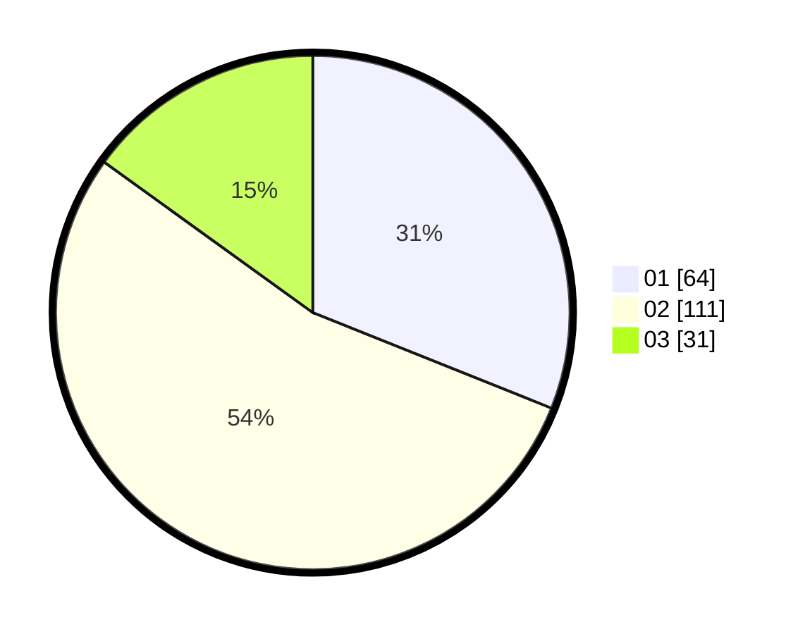

# Hasil

Hasil perolehan suara paslon dapat dilihat pada file paslon-01.txt, paslon-02.txt, dan paslon-03.txt.

Jika tidak ada, artinya data tersebut belum ada pada SIREKAP.

## Perolehan Suara

 * Paslon 01: **64**.
 * Paslon 02: **111**.
 * Paslon 03: **31**.

## Foto C Plano

https://sirekap-obj-formc.kpu.go.id/a3db/pemilu/ppwp/31/01/01/10/01/3101011001013-20240216-131603--b37e4c63-1e9a-4e46-9dd9-434d74db377e.jpg

https://sirekap-obj-formc.kpu.go.id/a3db/pemilu/ppwp/31/01/01/10/01/3101011001013-20240216-131604--8a8ede27-6b2c-4af3-b365-6a0ba0d211cc.jpg

https://sirekap-obj-formc.kpu.go.id/a3db/pemilu/ppwp/31/01/01/10/01/3101011001013-20240216-131603--17038bf2-17f8-45c5-a2b4-cda8915ad6dc.jpg

## DATA PEMILIH TETAP

Jumlah pemilih dalam DPT: **0**.
 * L: **0**.
 * P: **0**.

## DATA PENGGUNA HAK PILIH

Jumlah pengguna hak pilih dalam DPT: **0**.
 * L: **0**.
 * P: **0**.

Jumlah pengguna hak pilih dalam DPTb: **0**.
 * L: **0**.
 * P: **0**.

Jumlah pengguna hak pilih dalam DPK: **0**.
 * L: **0**.
 * P: **0**.

Jumlah pengguna hak pilih: **0**.
 * L: **0**.
 * P: **0**.

## JUMLAH SUARA SAH DAN TIDAK SAH

JUMLAH SELURUH SUARA SAH: **206**.

JUMLAH SUARA TIDAK SAH: **4**.

JUMLAH SELURUH SUARA SAH DAN SUARA TIDAK SAH: **210**.
