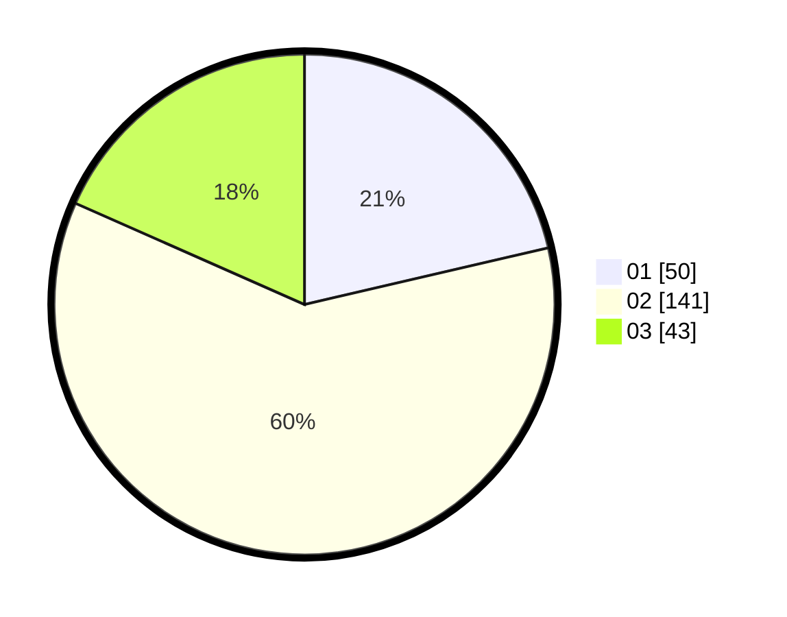

# Hasil

Hasil perolehan suara paslon dapat dilihat pada file paslon-01.txt, paslon-02.txt, dan paslon-03.txt.

Jika tidak ada, artinya data tersebut belum ada pada SIREKAP.

## Perolehan Suara

 * Paslon 01: **50**.
 * Paslon 02: **141**.
 * Paslon 03: **43**.

## Foto C Plano

https://sirekap-obj-formc.kpu.go.id/3f44/pemilu/ppwp/31/01/01/10/01/3101011001014-20240214-194331--dd554cff-97a8-4dc9-a4bd-d086b609b2c5.jpg

https://sirekap-obj-formc.kpu.go.id/3f44/pemilu/ppwp/31/01/01/10/01/3101011001014-20240214-194443--843fa609-faee-4fbc-b3ec-3c413d7caab0.jpg

https://sirekap-obj-formc.kpu.go.id/3f44/pemilu/ppwp/31/01/01/10/01/3101011001014-20240214-194513--d6a2d1f7-e310-4751-8fa5-921bb4e015a3.jpg

## DATA PEMILIH TETAP

Jumlah pemilih dalam DPT: **288**.
 * L: **134**.
 * P: **154**.

## DATA PENGGUNA HAK PILIH

Jumlah pengguna hak pilih dalam DPT: **233**.
 * L: **111**.
 * P: **122**.

Jumlah pengguna hak pilih dalam DPTb: **3**.
 * L: **2**.
 * P: **1**.

Jumlah pengguna hak pilih dalam DPK: **0**.
 * L: **0**.
 * P: **0**.

Jumlah pengguna hak pilih: **236**.
 * L: **113**.
 * P: **123**.

## JUMLAH SUARA SAH DAN TIDAK SAH

JUMLAH SELURUH SUARA SAH: **234**.

JUMLAH SUARA TIDAK SAH: **2**.

JUMLAH SELURUH SUARA SAH DAN SUARA TIDAK SAH: **236**.
