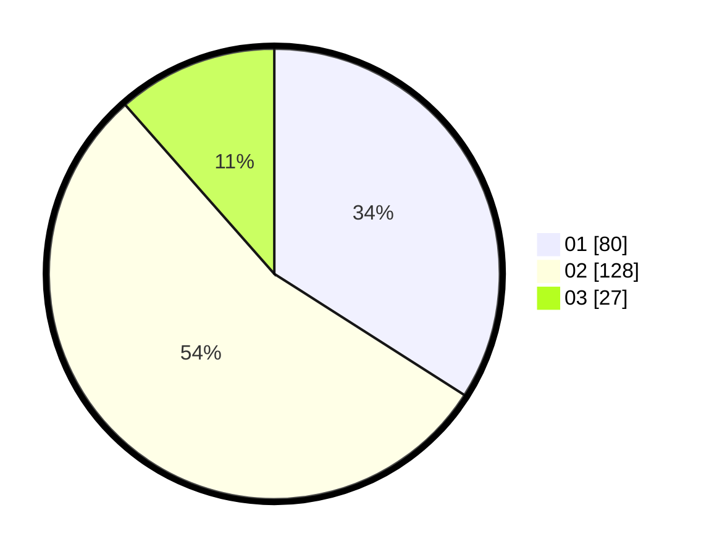

# Hasil

Hasil perolehan suara paslon dapat dilihat pada file paslon-01.txt, paslon-02.txt, dan paslon-03.txt.

Jika tidak ada, artinya data tersebut belum ada pada SIREKAP.

## Perolehan Suara

 * Paslon 01: **80**.
 * Paslon 02: **128**.
 * Paslon 03: **27**.

## Foto C Plano

https://sirekap-obj-formc.kpu.go.id/abf3/pemilu/ppwp/31/01/01/10/01/3101011001016-20240216-145811--9c245854-b26a-4141-b05b-367f58ae611c.jpg

https://sirekap-obj-formc.kpu.go.id/abf3/pemilu/ppwp/31/01/01/10/01/3101011001016-20240215-004240--84ace4f7-a760-4951-aa74-414eeeae3990.jpg

https://sirekap-obj-formc.kpu.go.id/abf3/pemilu/ppwp/31/01/01/10/01/3101011001016-20240216-145812--dd622908-3a5e-4ad0-82d5-f06e5776debf.jpg

## DATA PEMILIH TETAP

Jumlah pemilih dalam DPT: **283**.
 * L: **141**.
 * P: **142**.

## DATA PENGGUNA HAK PILIH

Jumlah pengguna hak pilih dalam DPT: **226**.
 * L: **112**.
 * P: **114**.

Jumlah pengguna hak pilih dalam DPTb: **5**.
 * L: **2**.
 * P: **3**.

Jumlah pengguna hak pilih dalam DPK: **4**.
 * L: **2**.
 * P: **2**.

Jumlah pengguna hak pilih: **235**.
 * L: **116**.
 * P: **119**.

## JUMLAH SUARA SAH DAN TIDAK SAH

JUMLAH SELURUH SUARA SAH: **235**.

JUMLAH SUARA TIDAK SAH: **0**.

JUMLAH SELURUH SUARA SAH DAN SUARA TIDAK SAH: **235**.
