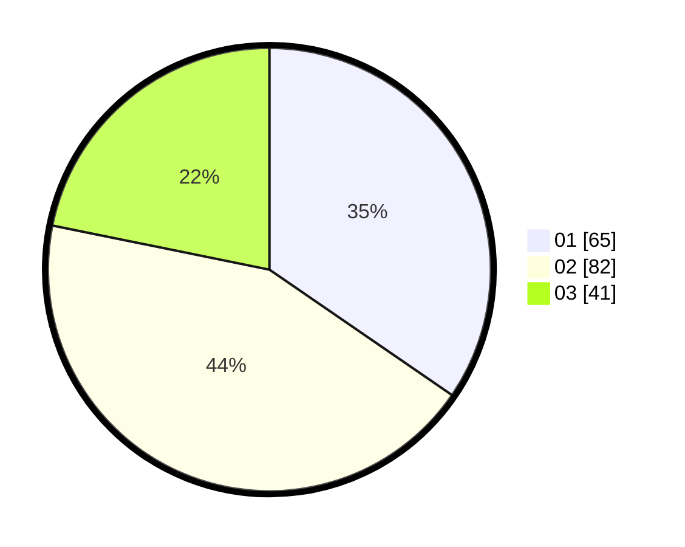

# Hasil

Hasil perolehan suara paslon dapat dilihat pada file paslon-01.txt, paslon-02.txt, dan paslon-03.txt.

Jika tidak ada, artinya data tersebut belum ada pada SIREKAP.

## Perolehan Suara

 * Paslon 01: **65**.
 * Paslon 02: **82**.
 * Paslon 03: **41**.

## Foto C Plano

https://sirekap-obj-formc.kpu.go.id/2550/pemilu/ppwp/31/01/01/10/01/3101011001017-20240214-214129--d9709c46-6d9d-4527-aff7-59b9105b8a80.jpg

https://sirekap-obj-formc.kpu.go.id/2550/pemilu/ppwp/31/01/01/10/01/3101011001017-20240214-214515--96e7099a-c123-4686-93b5-8c85dbb9e89f.jpg

https://sirekap-obj-formc.kpu.go.id/2550/pemilu/ppwp/31/01/01/10/01/3101011001017-20240214-214904--71a5b333-3ffd-4ffb-855a-849640c6b6b4.jpg

## DATA PEMILIH TETAP

Jumlah pemilih dalam DPT: **238**.
 * L: **120**.
 * P: **118**.

## DATA PENGGUNA HAK PILIH

Jumlah pengguna hak pilih dalam DPT: **185**.
 * L: **88**.
 * P: **97**.

Jumlah pengguna hak pilih dalam DPTb: **8**.
 * L: **7**.
 * P: **1**.

Jumlah pengguna hak pilih dalam DPK: **0**.
 * L: **0**.
 * P: **0**.

Jumlah pengguna hak pilih: **193**.
 * L: **95**.
 * P: **98**.

## JUMLAH SUARA SAH DAN TIDAK SAH

JUMLAH SELURUH SUARA SAH: **188**.

JUMLAH SUARA TIDAK SAH: **5**.

JUMLAH SELURUH SUARA SAH DAN SUARA TIDAK SAH: **193**.
